Nethereum 支持 Microsoft Azure，下面将向您展示如何在 Azure 上部署私有区块链并开始与之交互：

## 1 - 创建 [Azure 帐户](https://azure.microsoft.com/en-us/resources/videos/sign-up-for-microsoft-azure/) 如果您已经有一个，请进行[签名](https://azure.microsoft.com/en-us/account/) 

## 2 - 在 Azure 仪表板上创建新资源
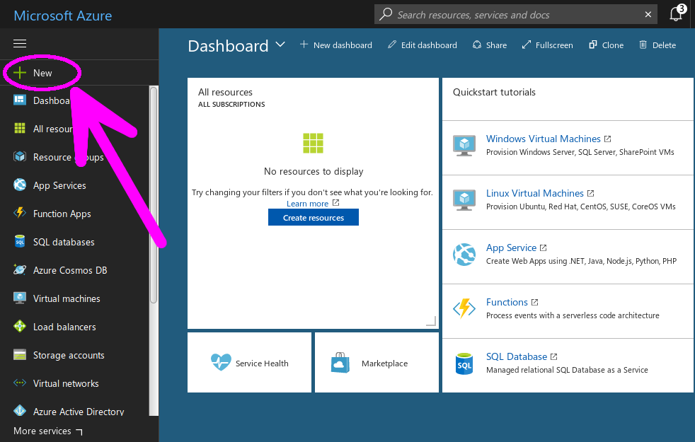

## 3 - 在资源搜索栏中，输入```以太坊联盟区块链（ethereum consortium blockchain）``` 选择以太坊联盟模板，然后点击“创建”。
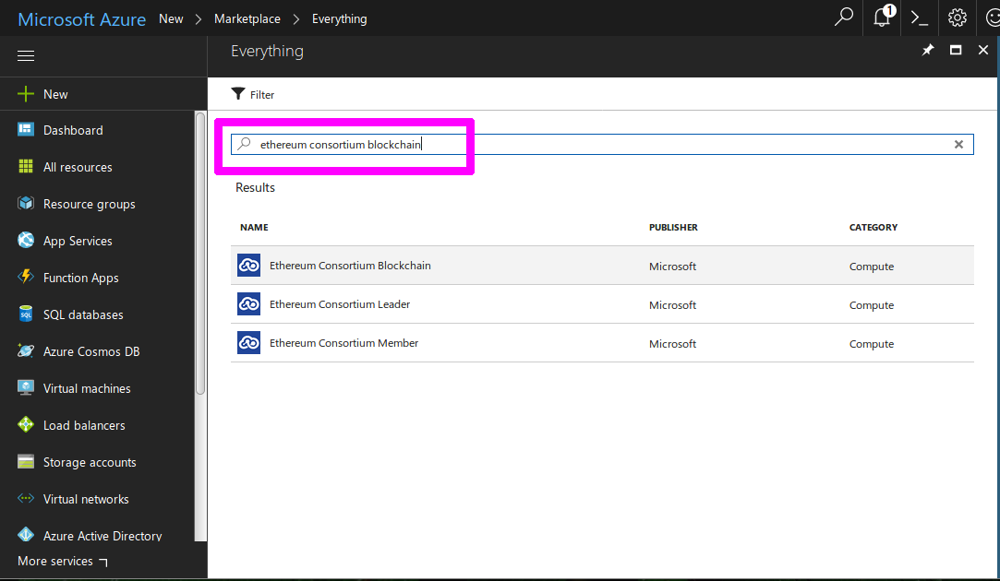

## 4 - 点击创建确认部署模型
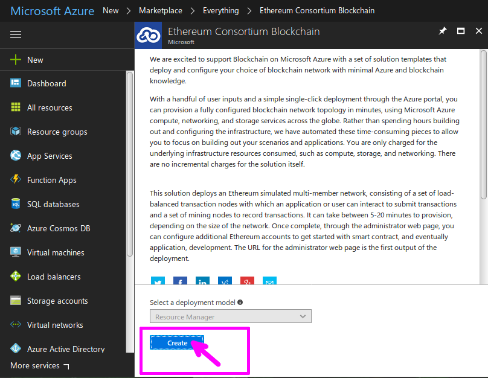

## 5 - 输入您的区块链的规格，然后单击确定

### - 联盟成员数量

网络中的挖矿成员数量。 将为每个挖矿成员形成子网。 （2至12名成员）

### - 每个成员的挖矿节点数

每个成员部署的挖矿节点数。挖矿节点总数 = 成员 * 每个成员的节点数。 （1 到 15 个节点/成员）

### - 挖矿节点存储性能

事务数据库的存储类型。 （标准或高级）

### - 交易节点数

要创建的事务节点数。 (1 到 5)

### - 交易节点存储性能

事务数据库的存储类型。 （标准或高级）

### - 交易节点存储复制

### - 存储复制策略。 （LRS、GRS、RAGRS）

### - 交易节点虚拟机大小
事务节点虚拟机的大小。 （标准 A、标准 D、标准 D-v2、标准 F 系列、标准 DS 和标准 FS）
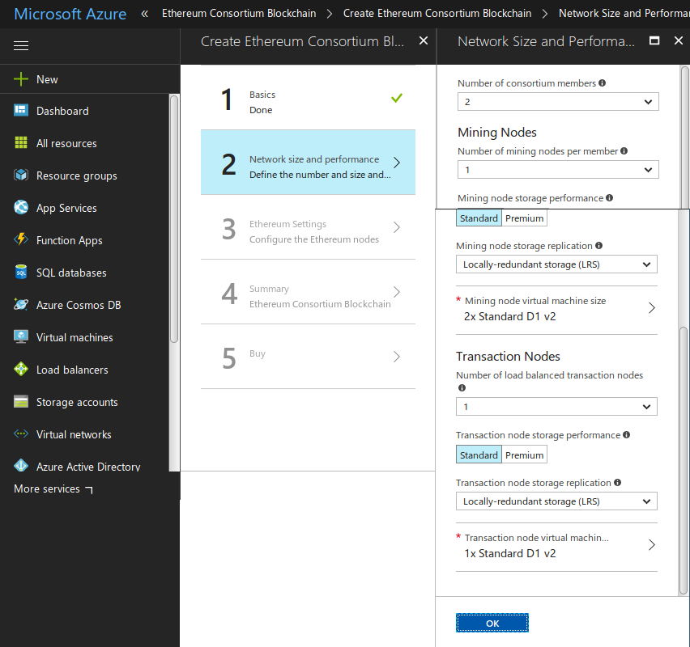

## 6 - 提交网络 ID、一些密码，然后单击“确定”。
理想情况下，网络 ID 应介于 4 到 9 位数字之间。
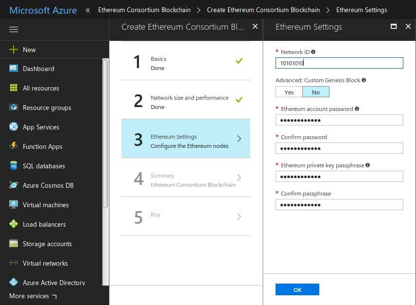

## 7 - 查看您的区块链规格，然后单击“确定”。
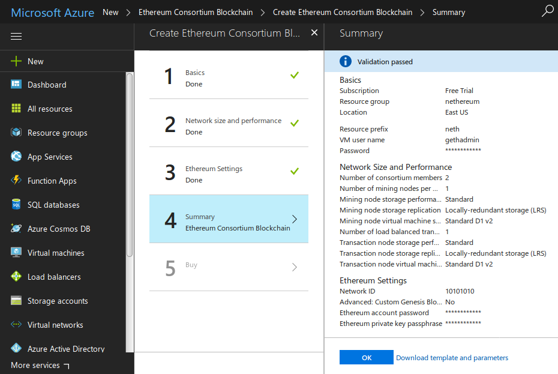

## 8 - 同意（或不同意）使用条款，给 Azure 服务器几分钟的时间来部署你的链。
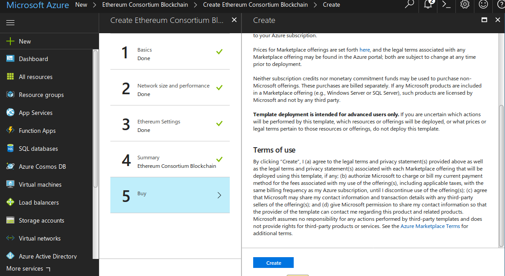
Azure 应该需要几分钟来部署你的链。

## 9 - 连接到您的链

现在您的链已部署，您可以通过创建 Web3 实例与其进行交互：
```C#
var web3 = new Web3("http://nethxrkkoyst.eastus.cloudapp.azure.com:8545");
```
要检索您的链的 URL，请转到您的 Azure 仪表板并选择以下类型的 Azure 实例：“公共 IP 地址”，然后选择“概述”。 提供的 URL 是您的链的地址
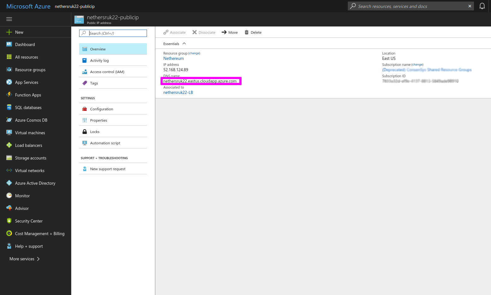

您还可以使用 RPC 检索或修改用于与您的链进行交易的端口。 在 Azure 仪表板上，选择 ``` Network Security Group ``` RPC 端口将在线 ``` allow-geth-RPC ```
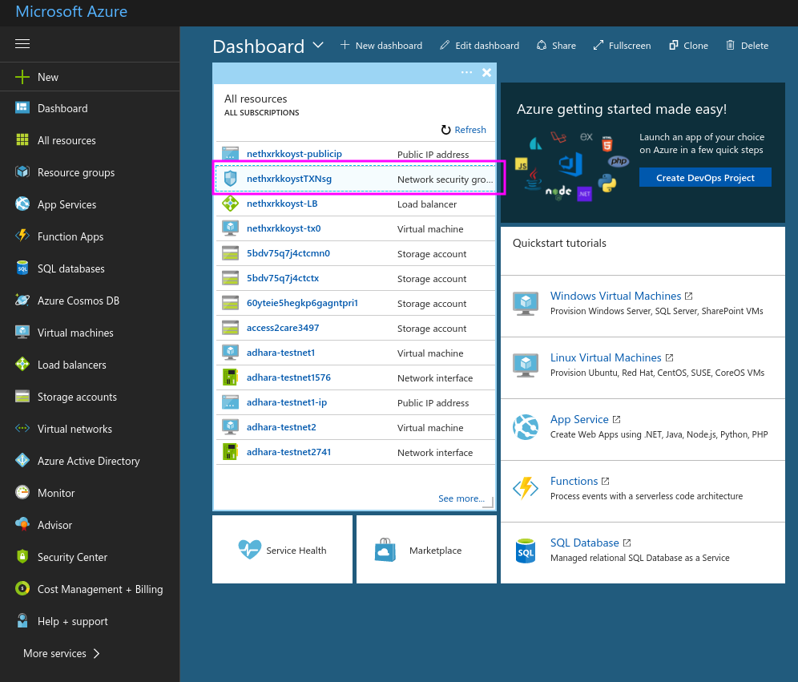
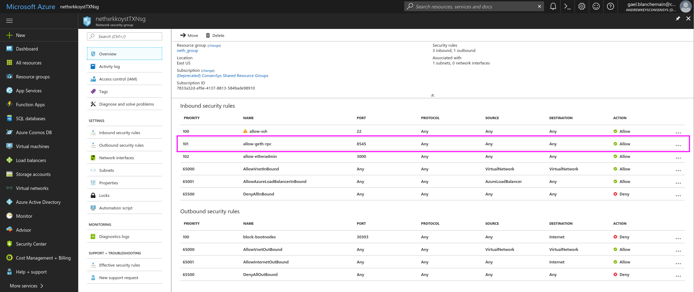


## 10 - 在您部署的链上创建一个帐户
您可以轻松地创建以太坊账户并与 Nethereum 进行交易。 使用以下 C# 命令：

```C#
var ecKey = Nethereum.Signer.EthECKey.GenerateKey();
var address = ecKey.GetPublicAddress();
```
这将返回您的新帐户地址，应如下所示：
``` "0xC33c96764640662A51d073347Df73546aCAb7715" ```
现在您可以通过以下方式显示帐户的私钥：
```C#
var privateKey = ecKey.GetPrivateKey();
"0x42360260880d7be8d401552cc9e41020c726b10ee8d2622d138b09c86e29e7a5"
```
下一步是使用您的私钥创建一个“Account”实例：
```C#
var account = new Account("0xb5b1870957d373ef0eeffecc6e4812c0fd08f554b37b233526acc331bf1544f7");
```

最后，要使用您的新帐户启用交易，您可以使用您的帐户作为变量创建一个新的 Web3 实例：
```C#
var web3 = new Web3(account);
```

## 11 - 用一些以太币设置一个帐户

要开始发送交易，您新创建的帐户将需要一些 Ether。 Azure BaaS 会自动部署一个 Ether Faucet，它将为任何地址提供 Ether。

水龙头的 URL 和你的链一样，可以从你的浏览器访问。

粘贴您的帐户地址，这应该会使用 1000 ETH 发送到您的帐户。

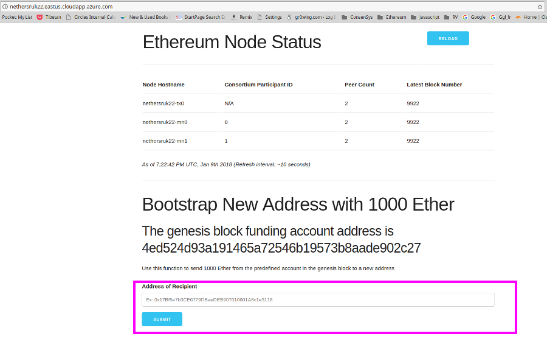

