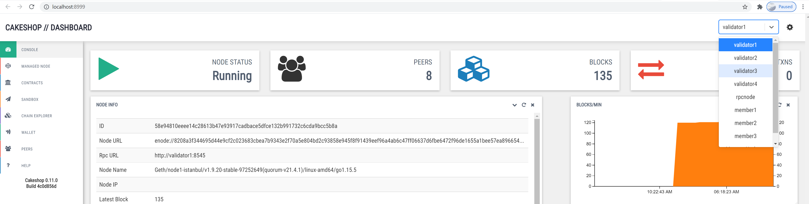

# Quorum

[Quorum](https://consensys.net/quorum/developers) 是一个品牌名称，包含针对企业使用的私有、许可、区块链的多种产品。 Quorum 专注于隐私，与以太坊主网明确显示其所有交易不同，Quorum 支持私人交易。 Quorum 产品还提供其他形式的共识，例如权威证明。

[GoQuorum](https://docs.goquorum.consensys.net/en/stable/) 是一个私有的、许可的、基于以太坊协议的官方 Go 实现的区块链。 GoQuorum 客户端是以太坊 Geth 的分叉版本。 本页介绍了如何将 **Nethereum** 与 **GoQuorum** 一起使用。 在下文中，Quorum 一词始终指的是 GoQuorum。

## 安装本地仲裁网络

设置 Quorum 实例最简单、最快的方法是使用 [Quorum Dev Quickstart](https://github.com/ConsenSys/quorum-dev-quickstart)。 如果您使用的是 Windows PC，则前提条件是您必须已安装 [WSL](https://docs.microsoft.com/en-us/windows/wsl/install-win10)、[Docker for Windows](https ://docs.docker.com/docker-for-windows/) 和 [Nodejs](https://nodejs.org/en/download/)。 本指南已在 Ubuntu 20.04 中使用 WSL 进行了测试。

安装先决条件后，Quorum Dev Quickstart 安装非常简单。 从 WSL shell（使用 [Windows Terminal](https://docs.microsoft.com/en-us/windows/terminal/get-started) 是一个有用的工具）运行以下命令：

```shell
$ npx quorum-dev-quickstart
```

你会被问到一系列关于你想要建立什么样的 Quorum 演示网络的问题。 根据提示，选择答案'2。 GoQuorum'，然后是“N”，您不想尝试 Orchestrate，然后是“Y”以启用对私有事务的支持，最后选择“N”表示不，您不需要使用 ELK 进行日志记录。

问题和答案应如下所示：

```
Which Ethereum client would you like to run? Default: [1]
        1. Hyperledger Besu
        2. GoQuorum
2
Do you want to try out Codefi Orchestrate? Note: choosing yes will direct you to a login/registration page. [Y/n]
N
Do you wish to enable support for private transactions? [Y/n]
Y
Do you wish to enable support for logging with ELK (Elasticsearch, Logstash & Kibana)? [y/N]
N
Where should we create the config files for this network? Please
choose either an empty directory, or a path to a new directory that does
not yet exist. Default: ./quorum-test-network
```
## 运行本地仲裁网络
现在您可以运行本地 Quorum 网络。 默认的快速入门构建并运行在 Docker 中运行的本地 Quorum 联盟网络。 有 3 个成员节点（有时称为交易节点）、4 个验证节点和一些支持服务，如区块浏览器和网络健康监视器。 每个成员节点都与它自己的 Tessera 节点配对。 Tessera 节点负责管理私人交易。

一旦网络启动并运行，我们就可以使用 Nethereum 与 Quorum 网络进行交互。 在 WSL shell 提示符下，运行：
```shell
$ cd quorum-test-network
$ ./run.sh
```
Docker 可能需要一些时间来下载它需要的内容，最终您应该会看到如下消息：
```
*************************************
Quorum Dev Quickstart
*************************************
----------------------------------
List endpoints and services
----------------------------------
JSON-RPC HTTP service endpoint      : http://localhost:8545
JSON-RPC WebSocket service endpoint : ws://localhost:8546
Web block explorer address          : http://localhost:25000/
Prometheus address                  : http://localhost:9090/graph
Grafana address                     : http://localhost:3000/d/a1lVy7ycin9Yv/goquorum-overview?orgId=1&refresh=10s&from=now-30m&to=now&var-system=All
Cakeshop toolkit address            : http://localhost:8999
```
在探索网络之前，首先要检查的是 Docker 是否已成功启动所有容器：

```shell
$ docker-compose ps
```
您应该看到类似于下面的输出。 要查找的主要内容是 `State` 列，其中所有内容都应显示为 `Up` 或 `Up (healthy)`：
```
                Name                              Command                  State     
-----------------------------------------------------------------------------------------
quorum-test-network_cakeshop_1         /bin/sh -c rm -rf /data/ca ...   Up (healthy)
quorum-test-network_ethsignerProxy_1   /opt/ethsigner/bin/ethsign ...   Up          
quorum-test-network_explorer_1         /docker-entrypoint.sh ngin ...   Up          
quorum-test-network_grafana_1          /run.sh                          Up          
quorum-test-network_member1quorum_1    /bin/sh -c                       Up (healthy)
quorum-test-network_member1tessera_1   /bin/sh -c mkdir -p /var/l ...   Up (healthy)
quorum-test-network_member2quorum_1    /bin/sh -c                       Up (healthy)
quorum-test-network_member2tessera_1   /bin/sh -c mkdir -p /var/l ...   Up (healthy)
quorum-test-network_member3quorum_1    /bin/sh -c                       Up (healthy)
quorum-test-network_member3tessera_1   /bin/sh -c mkdir -p /var/l ...   Up (healthy)
quorum-test-network_prometheus_1       /bin/prometheus --config.f ...   Up          
quorum-test-network_rpcnode_1          /bin/sh -c mkdir -p /var/l ...   Up (healthy)
quorum-test-network_validator1_1       /bin/sh -c mkdir -p /var/l ...   Up (healthy)
quorum-test-network_validator2_1       /bin/sh -c mkdir -p /var/l ...   Up (healthy)
quorum-test-network_validator3_1       /bin/sh -c mkdir -p /var/l ...   Up (healthy)
quorum-test-network_validator4_1       /bin/sh -c mkdir -p /var/l ...   Up (healthy)
```
这里有 [更多文档](https://github.com/ConsenSys/quorum-dev-quickstart/blob/master/files/gquorum/README.md) 解释了有关如何使用网络的更多信息。

## 使用 CakeShop 探索本地 Quorum 网络
现在 Quorum 网络已经启动并运行，我们可以使用 CakeShop 来探索我们拥有的节点。 在浏览器中输入 `http://localhost:8999` 以打开 CakeShop 应用程序：



右上角的下拉菜单允许您在节点之间切换。

# 将 Nethereum 与 Quorum 一起使用
现在运行 Quorum 网络，我们可以使用 Nethereum 与之交互。
## 获取最新区块号
将 nuget 包 `Nethereum.Web3` 和 `Nethereum.Quorum` 添加到您的项目中，然后使用以下代码检索最新的块号：

```C#
using Nethereum.Quorum;
using Nethereum.Web3;
```
```C#
var urlMember1 = "http://127.0.0.1:20000";
Web3Quorum web3Quorum = new Web3Quorum(urlMember1);            
HexBigInteger blockNumber = await web3Quorum.Eth.Blocks.GetBlockNumber.SendRequestAsync();
```
我们怎么知道 member1 URL 是什么？ 答案在于 Quorum Dev Quickstart 之前为我们生成的文件。 如果您在快速启动安装期间使用的目录下查看 WSL，（默认为 `quorum-test-network`），您将看到一个名为 `docker-compose.yml` 的文件。 在该文件中有一个标题“member1quorum”和一个端口号。 下面的第一个端口行显示外部端口是 20000。

```yaml
  member1quorum:
    << : *quorum-member-def
    ports:
      - 20000:8545/tcp
```

## 发布私人交易
如上所述，私人交易由 Tessera 节点管理。 主链上存在私人交易，但交易有效负载仅存在于参与该交易的成员的 Tessera 节点中。

我们将在 member1 和 member2 之间创建一个私人交易。 Member3 将无法查看此交易的详细信息。 在我们发布私人交易之前，我们需要知道：

1) **member1** 的 Tessera 节点 URL。

2) 我们要与之共享交易的成员节点的 Tessera 公钥，在本例中为 **member2**。

要获得这些信息，我们需要再次查看快速入门为我们生成的文件。 对于 1）我们再次查看 `docker-compose.yml` 并找到标题 `member1tessera1`：

```yaml
  member1tessera:
    << : *tessera-def
    ports:
      - 9081:9080
```
我们可以看到外部端口是 9081。

对于 2)，如果您查看目录 `/quorum-test-network/config/quorum/networkFiles/member2`，您将看到一个名为 `tm.pub` 的文件。 该文件包含 member2 的 Tessera 节点的公钥。 这个公钥值就是我们需要的：

```shell
$ cat tm.pub
QfeDAys9MPDs2XHExtc84jKGHxZg/aj52DTh0vtA3Xc=
```
现在在您的 C# 项目中，您可以开始编写私有事务。 首先设置一个“Web3Quorum”，如下所示：
```C#
// Setup a web3Quorum with read/write capability for member1
var urlMember1 = "http://127.0.0.1:20000";
var urlMember1Tessera = "http://127.0.0.1:9081";
// This private key can be any old value, since all accounts are open and gas is free
var privateKeyMember1 = "0x7580e7fb49df1c861f0050fae31c2224c6aba908e116b8da44ee8cd927b990b0";
var accountMember1 = new QuorumAccount(privateKeyMember1);
Web3Quorum web3Quorum = new Web3Quorum(accountMember1, urlMember1Tessera, urlMember1);

// Specify who will share in private transactions, in this case it is member2
var tesseraPublicKeyOfMember2 = @"QfeDAys9MPDs2XHExtc84jKGHxZg/aj52DTh0vtA3Xc=";
var privateFor = new List<string> { tesseraPublicKeyOfMember2 };
web3Quorum.SetPrivateRequestParameters(privateFor);
```
现在我们有一个用于 member1 的“Web3Quorum”，它被配置为只与 member2 共享私人交易。 如果我们想与更多成员共享交易，我们将在上面的代码中为 **privateFor** `List` 变量添加更多键。

对于这个例子，我们将部署一个 ERC20 代币作为我们的私人交易。 首先将 nuget 包 `Nethereum.StandardTokenEIP20` 添加到您的项目中，并添加以下代码：
```C#
using Nethereum.StandardTokenEIP20;
using Nethereum.StandardTokenEIP20.ContractDefinition;
```
```C#
// Deploy contract
int expectedTotalSupply = 1_000_000;
var deploymentContract = new EIP20Deployment()
{
    InitialAmount = expectedTotalSupply,
    TokenName = "TestToken",
    TokenSymbol = "TEST"
};
StandardTokenService tokenServiceMember1 = await StandardTokenService.DeployContractAndGetServiceAsync(web3Quorum, deploymentContract);
string contractAddress = tokenServiceMember1.ContractHandler.ContractAddress;
Console.WriteLine(contractAddress);
```
现在私有合约已经部署完毕，我们可以检查它对 member1 和 member2 可见，但对 member3 不可见。 member2 和 member3 的端口号是从 docker-compose.yml 中检索的，与我们检索 member1 的端口的方式相同。

```C#
// Member1 can see total supply
int totalSupplyMember1 = (int)await tokenServiceMember1.TotalSupplyQueryAsync();
Console.WriteLine($"Member1 sees: {totalSupplyMember1}");

// Member2 can see total supply            
var urlMember2 = "http://127.0.0.1:20002";
var web3QuorumMember2 = new Web3Quorum(urlMember2);
var tokenServiceMember2 = new StandardTokenService(web3QuorumMember2, contractAddress);
int totalSupplyMember2 = (int)await tokenServiceMember2.TotalSupplyQueryAsync();
Console.WriteLine($"Member2 sees: {totalSupplyMember2}");

// Member 3 cannot see total supply
var urlMember3 = "http://127.0.0.1:20004";
var web3QuorumMember3 = new Web3Quorum(urlMember3);
var tokenServiceMember3 = new StandardTokenService(web3QuorumMember3, contractAddress);
int totalSupplyMember3 = (int)await tokenServiceMember3.TotalSupplyQueryAsync();
Console.WriteLine($"Member3 sees: {totalSupplyMember3}");
```
上面运行时应显示以下内容：
```
Member1 sees: 1000000
Member2 sees: 1000000
Member3 sees: 0
```

## 关闭本地仲裁网络
您可以使用 `./stop.sh` 和 `./resume/sh` 来停止并恢复网络并保留数据。 使用 `./remove.sh` 停止并删除网络，使用 `./run.sh` 再次打开一个干净的空网络。