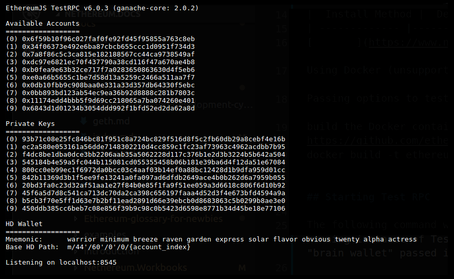

## Test RPC 配置和使用

**注意：Truffle 团队最近用 Ganache 替换了 Test RPC，我们建议阅读我们的 Ganache [设置说明](ganache-cli.md)。**

Ethereum TestRPC 是一个快速且可定制的区块链模拟器。 它允许在没有运行实际以太坊节点的开销的情况下调用区块链。

* 可以使用固定数量的以太币（无需水龙头或挖矿）重新循环、重置和实例化帐户。
* 可以修改 Gas 价格和挖矿速度。

### 开始使用

|  安装方法 | 命令 |
| ------------- |---------|
|[via NPM](https://www.npmjs.com/package/ethereumjs-testrpc) |  ` npm install -g ethereumjs-testrpc `|
|Quicks start using Docker image (unsupported) | ` docker run -d -p 8545:8545 ethereumjs/testrpc:latest ` |
|Passing options to testrpc through Docker |  ` docker run -d -p 8545:8545 ethereumjs/testrpc:latest -a 10 --debug ` |
|Build the Docker container from source |  ` git clone https://github.com/ethereumjs/testrpc.git && cd testrpc docker build -t ethereumjs/testrpc ` |

## 启动Test RPC

以下命令将启动一个 testrpc 实例。 Testrpc 将自动从通过 -m 开关传入的种子短语生成帐户。

` testrpc -m "small failure organs crooks zero delivery fired extreme lost twenty alpha terror" `

## Implemented Methods

当前实现的一些 RPC 方法是：

- ` bzz_hive (stub) `
- ` bzz_info (stub) `
- ` debug_traceTransaction `
- ` eth_accounts `
- ` eth_blockNumber `
- ` eth_call `
- ` eth_coinbase `
- ` eth_estimateGas `
- ` eth_gasPrice `
- ` eth_getBalance `
- ` eth_getBlockByNumber `
- ` eth_getBlockByHash `
- ` eth_getBlockTransactionCountByHash `
- ` eth_getBlockTransactionCountByNumber `
- ` eth_getCode (only supports block number “latest”) `
- ` eth_getCompilers `
- ` eth_getFilterChanges `
- ` eth_getFilterLogs `
- ` eth_getLogs `
- ` eth_getStorageAt `
- ` eth_getTransactionByHash `
- ` eth_getTransactionByBlockHashAndIndex `
- ` eth_getTransactionByBlockNumberAndIndex `
- ` eth_getTransactionCount `
- ` eth_getTransactionReceipt `
- ` eth_hashrate `
- ` eth_mining `
- ` eth_newBlockFilter `
- ` eth_newFilter (includes log/event filters) `
- ` eth_protocolVersion `
- ` eth_sendTransaction `
- ` eth_sendRawTransaction `
- ` eth_sign `
- ` eth_syncing `
- ` eth_uninstallFilter `
- ` net_listening `
- ` net_peerCount `
- ` net_version `
- ` miner_start `
- ` miner_stop `
- ` personal_listAccounts `
- ` personal_lockAccount `
- ` personal_newAccount `
- ` personal_unlockAccount `
- ` personal_sendTransaction `
- ` shh_version `
- ` rpc_modules `
- ` web3_clientVersion `
- ` web3_sha3 `

还有一些特殊的非标准方法未包含在原始 RPC 规范中：

|方法|定义|
|--------|----|
|evm_snapshot : |快照当前区块的区块链状态。 不接受任何参数。 返回创建的快照的整数 id。|
| evm_revert :| 将区块链的状态恢复到以前的快照。 采用单个参数，即要恢复到的快照 ID。 如果没有传递快照 ID，它将恢复到最新的快照。 返回true。|
|evm_increaseTime:| 及时向前跳跃。 采用一个参数，即增加的时间量（以秒为单位）。 返回总时间调整，以秒为单位。|
|evm_mine : |强制开采一个区块。 不接受任何参数。 与是否开始或停止采矿无关地开采一个块。 不支持的方法。|
|eth_compileSolidity:| 如果您想在 Javascript 中进行 Solidity 编译，请参阅 solc-js 项目。 Docker.|
