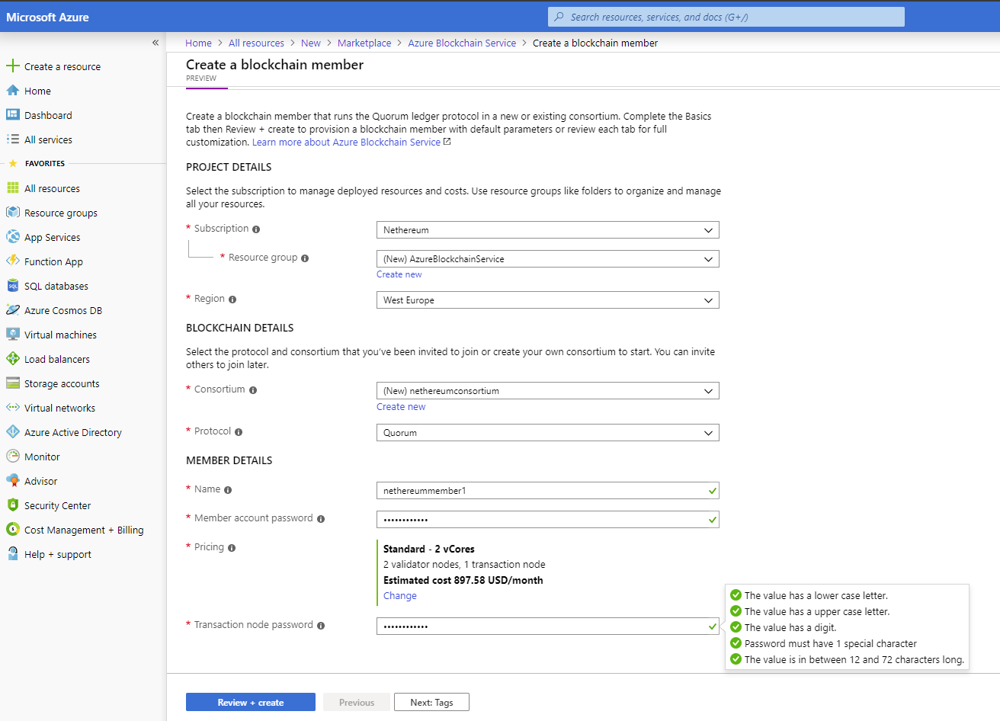
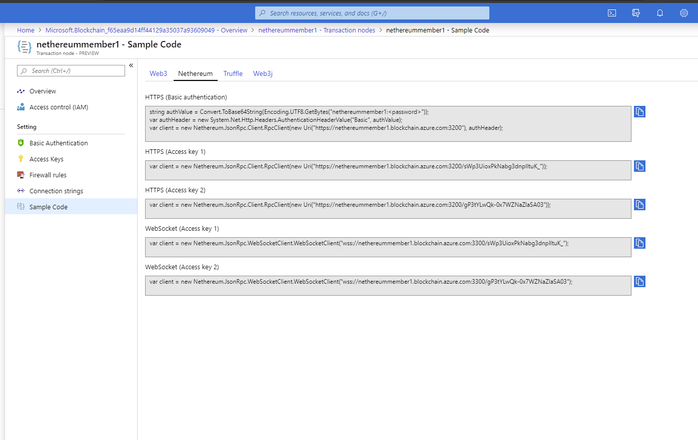

# Nethereum：与 Azure 和 Quorum 集成

本文演示了如何将 Nethereum 与 Azure 区块链服务和 Quorum集成

如果您想直接运行示例，请随意使用 Nethereum 的 Playground：
- [Azure Blockchain Service: Interacting with a Quorum member node](http://playground.nethereum.com/csharp/id/1046)
- [Azure Blockchain Service: Interacting in private with a Quorum member](http://playground.nethereum.com/csharp/id/1047)

### 1 -创建 [Azure 帐户](https://azure.microsoft.com/en-us/resources/videos/sign-up-for-microsoft-azure/) 如果您已经有一个，请进行[签名](https://azure.microsoft.com/en-us/account/) 

### 2 - 在 Azure 仪表板上创建仲裁区块链成员


创建区块链成员将在 Azure 上启动一个具有两个验证器节点和一个事务节点的网络，创建一个联盟并使您成为该联盟的成员。 如果你在现有联盟中创建成员，Azure 会将你的帐户添加为成员。

# 与 Quorum 互动

### Web3 设置和身份验证



- 选择您新创建的联盟成员的名称
- 选择“交易节点”
- 从节点列表中选择您需要连接的节点，然后选择“示例代码”
- 最后选择“Nethereum”选项卡。 您将获得一个可以选择的预填充方法列表，以连接到您的特定 Quorum 实例。

## 在公共模式下与仲裁 Azure 服务成员交互

#### 网址基本认证

所需库:
```C#
using Nethereum.Web3;
using Nethereum.ABI.FunctionEncoding.Attributes;
using Nethereum.Contracts.CQS;
using Nethereum.Util;
using Nethereum.Web3.Accounts;
using Nethereum.Hex.HexConvertors.Extensions;
using Nethereum.Contracts;
using Nethereum.Contracts.Extensions;
using Nethereum.Web3.Accounts.Managed;
using System;
using System.Numerics;
using System.Threading;
using System.Threading.Tasks;
```
可以通过在 URL 中包含用户名和密码来使用基本用户/密码身份验证：

```https:<membername>:<password>@membername.blockchain.azure.com:3200```

要创建 Web3 的只读实例，您只需执行以下操作：

```C#
var web3 = new Web3("https:<quorumMemberName>:<password>@quorumMemberName.blockchain.azure.com:3200");
var blockNumber = await web3.Eth.Blocks.GetBlockNumber.SendRequestAsync();
```
#### 基于令牌的身份验证

可以在 Azure 仪表板上找到身份验证令牌，网址为 ```home > {quorumMemberName} - Transaction nodes > {quorumMemberName} - Access Keys```

访问令牌身份验证将使用以下格式：

```https:membername.blockchain.azure.com:3200/<token>```

创建 Web3 的读/写实例如下：

```C#
var urlWithToken = "https:quorumMemberName.blockchain.azure.com:3200/<token>_";
var memberAddress = "ADDRESS";
var memberPassword = "THEPASSWORD";
var web3 = new Web3(urlWithToken);
```

# 托管账户和合约交互

要与交易节点交互（发送交易），您可以使用交易节点地址和密码创建托管账户。
您可以在此处阅读有关 **Accounts** 的更多信息：https://nethereum.readthedocs.io/en/latest/accounts/

在此示例中，我们使用 ManagedAccount 地址和密码创建了一个 Web3 实例。

稍后，我们将使用 ERC2O 标准代币服务执行的交易进行耦合，一个用于部署智能合约，另一个用于转移一些代币。

## 使用ManagedAccount创建 Web3 实例

```C#
  var managedAccount = new ManagedAccount("0xca1e76c9876e5ba1e7c307696a7ea48eb25eec8c", "password");
  var web3Managed = new Web3(managedAccount, "https://membername.blockchain.azure.com:3200/<token>");
  var balance = await web3Managed.Eth.GetBalance.SendRequestAsync("0xca1e76c9876e5ba1e7c307696a7ea48eb25eec8c");
```

我们可以使用相同的设置来部署 ERC20 智能合约，并且与它的交互与 per 相同
新的 ERC20 智能合约（合约和函数定义在本页末尾）
```solidity
var deploymentMessage = new StandardTokenDeployment
{
TotalSupply = 100000
};
var deploymentHandler = web3Managed.Eth.GetContractDeploymentHandler<StandardTokenDeployment>();

var transactionReceipt = await deploymentHandler.SendRequestAndWaitForReceiptAsync(deploymentMessage);

var contractAddress = transactionReceipt.ContractAddress;
```


## 在私有模式下与Quorum Azure 服务成员交互

所需库:
```C#
using Nethereum.Web3;
using Nethereum.ABI.FunctionEncoding.Attributes;
using Nethereum.Contracts.CQS;
using Nethereum.Util;
using Nethereum.Web3.Accounts;
using Nethereum.Hex.HexConvertors.Extensions;
using Nethereum.Contracts;
using Nethereum.Contracts.Extensions;
using Nethereum.Web3.Accounts.Managed;
using System;
using System.Numerics;
using System.Threading;
using System.Threading.Tasks;
```

下面演示了如何与 Quorum Azure 区块链服务的“私有模式”中的成员进行交互
您在与公共节点交互时会遇到的唯一区别是新 url 的使用，包括 Token
还使用 memberAddress 和密码解锁 ManagedAccount
最后需要设置可以访问私有节点中的合约和交易的节点。
```C#
var urlWithToken = "https:nethereummember1.blockchain.azure.com:3200/<token>_";
var memberAddress = "ADDRESS";
var memberPassword = "THEPASSWORD";

```
使用自定义 QuorumAccount 初始化 Web3Quorum，这是在私有模式下工作所必需的。

```C#
var web3Private = new Web3Quorum(new QuorumAccount(memberAddress), uriWithAccessTokenNode1);
var unlocked = await web3Private.Personal.UnlockAccount.SendRequestAsync(memberAddress, memberPassword, 30);

```
将此 web3 实例的节点设置为在私有模式下工作

```C#
web3Private.SetPrivateRequestParameters(new[]
{"8pZ4ekcWwnmQsz/Ea4Y/djWveSm57yQ4CZx79DwyOSk=", "UzQSRcULS1jHCFmcQkAoYh5vt7nL9U8pfy26qB+gy00="});

```
使用标准代币库服务部署新的 ERC20 智能合约

```C#
var deploymentMessage1 = new StandardTokenDeployment
{
TotalSupply = 100000
};

var deploymentHandler = web3Private.Eth.GetContractDeploymentHandler<StandardTokenDeployment>();

```
部署与在公共实例中一样完成

```C#
var transactionReceipt = await deploymentHandler.SendRequestAndWaitForReceiptAsync(deploymentMessage1);

var contractAddress = transactionReceipt.ContractAddress;
```

我们现在可以与合约交互，只有授权节点才能访问这些数据

```C#
var receiverAddress = "0xde0B295669a9FD93d5F28D9Ec85E40f4cb697BAe";
var transfer = new TransferFunction()
{
To = receiverAddress,
TokenAmount = 100
};
var transferHandler = web3Private.Eth.GetContractTransactionHandler<TransferFunction>();
var txnTransfer = await transferHandler.SendRequestAndWaitForReceiptAsync(contractAddress, transfer);

```

## 本文中使用的合同和功能定义

```C#
    public class StandardTokenDeployment : ContractDeploymentMessage
    {
        public static string BYTECODE =
            "0x60606040526040516020806106f5833981016040528080519060200190919050505b80600160005060003373ffffffffffffffffffffffffffffffffffffffff16815260200190815260200160002060005081905550806000600050819055505b506106868061006f6000396000f360606040523615610074576000357c010000000000000000000000000000000000000000000000000000000090048063095ea7b31461008157806318160ddd146100b657806323b872dd146100d957806370a0823114610117578063a9059cbb14610143578063dd62ed3e1461017857610074565b61007f5b610002565b565b005b6100a060048080359060200190919080359060200190919050506101ad565b6040518082815260200191505060405180910390f35b6100c36004805050610674565b6040518082815260200191505060405180910390f35b6101016004808035906020019091908035906020019091908035906020019091905050610281565b6040518082815260200191505060405180910390f35b61012d600480803590602001909190505061048d565b6040518082815260200191505060405180910390f35b61016260048080359060200190919080359060200190919050506104cb565b6040518082815260200191505060405180910390f35b610197600480803590602001909190803590602001909190505061060b565b6040518082815260200191505060405180910390f35b600081600260005060003373ffffffffffffffffffffffffffffffffffffffff16815260200190815260200160002060005060008573ffffffffffffffffffffffffffffffffffffffff168152602001908152602001600020600050819055508273ffffffffffffffffffffffffffffffffffffffff163373ffffffffffffffffffffffffffffffffffffffff167f8c5be1e5ebec7d5bd14f71427d1e84f3dd0314c0f7b2291e5b200ac8c7c3b925846040518082815260200191505060405180910390a36001905061027b565b92915050565b600081600160005060008673ffffffffffffffffffffffffffffffffffffffff168152602001908152602001600020600050541015801561031b575081600260005060008673ffffffffffffffffffffffffffffffffffffffff16815260200190815260200160002060005060003373ffffffffffffffffffffffffffffffffffffffff1681526020019081526020016000206000505410155b80156103275750600082115b1561047c5781600160005060008573ffffffffffffffffffffffffffffffffffffffff1681526020019081526020016000206000828282505401925050819055508273ffffffffffffffffffffffffffffffffffffffff168473ffffffffffffffffffffffffffffffffffffffff167fddf252ad1be2c89b69c2b068fc378daa952ba7f163c4a11628f55a4df523b3ef846040518082815260200191505060405180910390a381600160005060008673ffffffffffffffffffffffffffffffffffffffff16815260200190815260200160002060008282825054039250508190555081600260005060008673ffffffffffffffffffffffffffffffffffffffff16815260200190815260200160002060005060003373ffffffffffffffffffffffffffffffffffffffff1681526020019081526020016000206000828282505403925050819055506001905061048656610485565b60009050610486565b5b9392505050565b6000600160005060008373ffffffffffffffffffffffffffffffffffffffff1681526020019081526020016000206000505490506104c6565b919050565b600081600160005060003373ffffffffffffffffffffffffffffffffffffffff168152602001908152602001600020600050541015801561050c5750600082115b156105fb5781600160005060003373ffffffffffffffffffffffffffffffffffffffff16815260200190815260200160002060008282825054039250508190555081600160005060008573ffffffffffffffffffffffffffffffffffffffff1681526020019081526020016000206000828282505401925050819055508273ffffffffffffffffffffffffffffffffffffffff163373ffffffffffffffffffffffffffffffffffffffff167fddf252ad1be2c89b69c2b068fc378daa952ba7f163c4a11628f55a4df523b3ef846040518082815260200191505060405180910390a36001905061060556610604565b60009050610605565b5b92915050565b6000600260005060008473ffffffffffffffffffffffffffffffffffffffff16815260200190815260200160002060005060008373ffffffffffffffffffffffffffffffffffffffff16815260200190815260200160002060005054905061066e565b92915050565b60006000600050549050610683565b9056";

        public StandardTokenDeployment() : base(BYTECODE)
        {
        }

        [Parameter("uint256", "totalSupply")]
        public BigInteger TotalSupply { get; set; }
    }

    [Function("transfer", "bool")]
    public class TransferFunction : FunctionMessage
    {
        [Parameter("address", "_to", 1)]
        public string To { get; set; }

        [Parameter("uint256", "_value", 2)]
        public BigInteger TokenAmount { get; set; }
    }

    [Function("balanceOf", "uint256")]
    public class BalanceOfFunction : FunctionMessage
    {
        [Parameter("address", "_owner", 1)]
        public string Owner { get; set; }
    }
```
