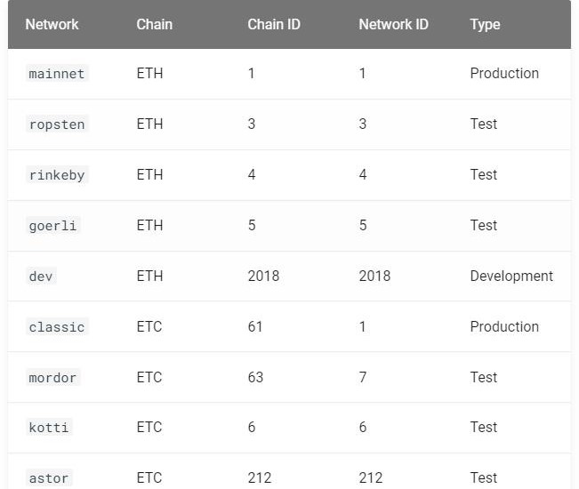
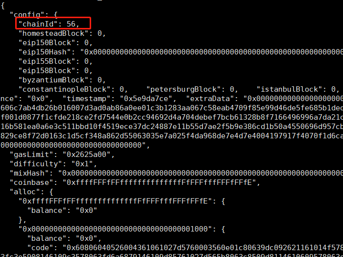

# 使用 Nethereum 管理 ChainID

### 前提条件:

首先，让我们下载与您的环境匹配的测试链： https://github.com/Nethereum/Testchains

使用 **startgeth.bat** (Windows) 或 **startgeth.sh** 启动 Geth 链（geth-clique-linux\、geth-clique-windows\ 或 geth-clique-mac\）(Mac /Linux)。 该链是通过权威证明共识(POA)建立的，并将立即开始Mining过程。

```C#
using Nethereum.Web3; 
using Nethereum.Signer; 
using Nethereum.Web3.Accounts; 
using Nethereum.Util; 
using Nethereum.Hex.HexConvertors.Extensions; 
using Nethereum.RPC.Eth.DTOs; 
using Nethereum.Hex.HexTypes;
```

# 用于管理防护重放攻击的Chain ID 

## 重放攻击

以太坊使得跨不同链发送相同交易成为可能，因此称为“重放攻击”。 例如，可以在测试链上进行资金转账，然后在主网上执行相同的转账（使用真实资金）。 此漏洞是由于相同的帐户可以存在于任何以太坊链中，并受相同的 privateKey 保护。

为了解决这个问题，以太坊实施了修复（改进名称是 [EIP155]），允许在签名交易中插入 ChainID 数据。 由于这一改进，现在可以通过在签名时包含其 ID 来强制交易仅在特定链上运行。

预配置的链 ID 可以在 Nethereum.Signer.Chain 中找到：



要在 geth 中配置 chainId，请按如下方式编辑 genesis（示例配置）：



要使用 ChainID 属性签署交易，我们需要使用我们的私钥和 ChainID 作为参数创建“帐户”对象的实例。

首先，我们需要声明我们的私钥：

```C#
var privatekey = "0xb5b1870957d373ef0eeffecc6e4812c0fd08f554b37b233526acc331bf1544f7";
```

然后我们可以使用 MainNet 中的 `chainId` 创建一个 Account 实例，如下所示：

```C#
var account = new Account(privatekey, Chain.MainNet);
```

或者只是使用我们的自定义chainId：

```C#
account = new Account(privatekey, 444444444500);
```

对于此示例，我们将使用已在测试网 **444444444500** 中设置的自定义 `chainId`。

我们现在可以使用配置了 chainId 的帐户创建一个新的 Web3 实例。 在内部，TransactionManager 将使用这个 `chainId` 来签署所有交易。

```C#
var web3 = new Web3(account);
```

让我们在一个简单的例子中使用它，例如转账ETH。

```C#
var toAddress = "0x13f022d72158410433cbd66f5dd8bf6d2d129924";
```

首先让我们将 1 Ether 转换为 Wei。

```C#
var wei = Web3.Convert.ToWei(1);
```

然后使用 TransactionManager 执行转账，等待收据。

```C#
 var transactionReceipt = await web3.TransactionManager.TransactionReceiptService.SendRequestAndWaitForReceiptAsync(
               new TransactionInput() {From = account.Address, To = toAddress, Value = new HexBigInteger(wei)}, null);
```

最后，我们可以看到接收者的地址余额增加了 1 Ether

```C#
 var balance = await web3.Eth.GetBalance.SendRequestAsync("0x13f022d72158410433cbd66f5dd8bf6d2d129924");
 var amountInEther = Web3.Convert.FromWei(balance.Value);
```
