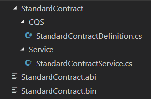
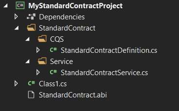

# 使用控制台应用程序生成 Nethereum 代码

*Nethereum.Generator.Console*

一个 dotnet Core CLI 工具，可以单独运行或作为 dotnet 安装。 它对于自动构建和集成脚本特别有用。

源码: [https://github.com/Nethereum/Nethereum/tree/master/generators/Nethereum.Generator.Console]

先决条件:

* [Net Core 2.1](https://www.microsoft.com/net/download)

它目前支持一个名为“generate”的主命令，其中包含以下子命令:

* [from-abi](#from-abi)
* [from-project](#from-project)

### 将控制台安装为 dotnet 工具（可选）

下面的示例将 Nethereum.Generator.Console 安装为全局工具 (-g)，并将本地文件夹引用为 nuget 包源 (--add-source)。

### 安装工具

```shell
dotnet tool install -g Nethereum.Generator.Console
```

### 访问帮助选项

```shell
Nethereum.Generator.Console -h
```

### 命令

#### from-abi

基于单个 abi 生成 Nethereum 代码.

```shell
Usage: generate from-abi [options]

Options:
  -cn  | --contractName  合约名称 (Optional)
  -ABi | --ABiPath       ABi文件路径 (Mandatory)
  -bin | --binPath       bin文件路径 (Optional)
  -o   | --outputPath    生成代码的输出路径 (Mandatory)
  -ns  | --namespace     生成代码的基本命名空间 (Mandatory)
  -sf  | --SingleFile    在单个文件中生成消息定义 (Optional - default is true)
  -?   | -h | --help     显示帮助信息
```

**例子**

创建一个文件夹并将您的 ABi 和 bin 文件放入其中。 转到命令行中的文件夹。

示例编译的 Solidity 文件：

* [StandardContract.abi](https://github.com/Nethereum/Nethereum/tree/master/generators/Nethereum.Generator.Console/sample/StandardContract.abi)
* [StandardContract.bin](https://github.com/Nethereum/Nethereum/tree/master/generators/Nethereum.Generator.Console/sample/StandardContract.bin)

使用最小参数调用生成器
```shell
Nethereum.Generator.Console generate from-abi -abi ./StandardContract.abi -o . -ns Sample.Ethereum
```

文件夹内容 - 代码生成后：



#### from-project

此命令在项目中搜索 ABI 文件并根据它们生成 Nethereum 代码。

生成的代码具有基于 ABi 文件和项目结构的命名空间和名称。

```shell
Usage: generate from-project [options]

Options:
  -p | --projectPath   The full project file path or path to the project folder (Optional - default is current directory).
  -a | --assemblyName  The output assembly name for the project (Optional - can be infered from project).
  -? | -h | --help     Show help information
```

**示例**

下面的示例从 .net 项目文件夹中的 StandardContract.ABi 生成 Nethereum .net 代码。
这些说明需要安装 .net core 2.1。

示例编译的 Solidity 文件:

* [StandardContract.abi](https://github.com/Nethereum/Nethereum/tree/master/generators/Nethereum.Generator.Console/sample/StandardContract.abi)
* [StandardContract.bin](https://github.com/Nethereum/Nethereum/tree/master/generators/Nethereum.Generator.Console/sample/StandardContract.bin)

步骤:
1. 创建一个文件夹:
```shell
mkdir MyStandardContractProject 
```
2. 导航进入文件夹: 
```shell
cd MyStandardContractProject 
```
!!! 警告
    将您的 ABI 和 bin 文件复制并粘贴到文件夹中
     
3. 创建一个dotnet类库：: 

```shell
dotnet new classLib 
```
4. 添加 Nethereum.Web3 作为依赖: 
```shell
dotnet add package Nethereum.Web3
```
5. 生成代码: 
```shell
Nethereum.Generator.Console generate from-project
```
6. 构建代码: 
```shell
dotnet build 
```

文件夹内容 - 代码生成后：



**配置驱动生成**

[from-project](#from-project) 命令将引用一个可选配置文件，以更好地控制代码生成。

如果项目目录中存在名为“Nethereum.Generator.json”的文件，则生成器将使用这些设置。

示例 Nethereum.Generator.json 配置文件。
```json
{
	"ABIConfigurations":
	[
		{
			"ContractName":"StandardContractA",
			"ABI":null,
			"ABIFile":"solidity\\StandardContract.ABi",
			"ByteCode":null,
			"BinFile":null,
			"BaseNamespace":null,
			"CQSNamespace":null,
			"DTONamespace":null,
			"ServiceNamespace":null,
			"CodeGenLanguage":"CSharp",
			"BaseOutputPath":null
		}
	]
}
```
