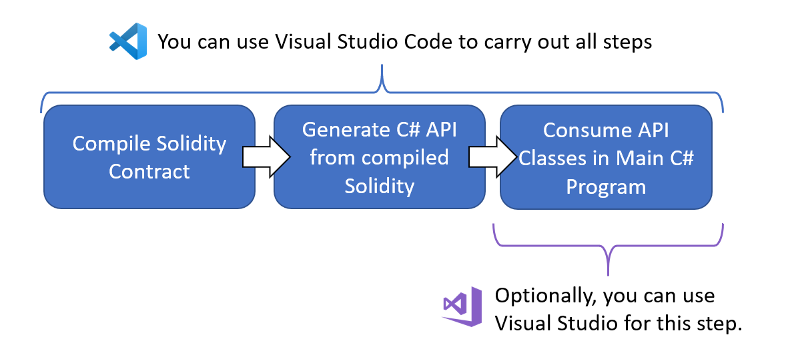
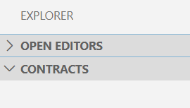
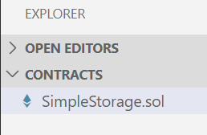
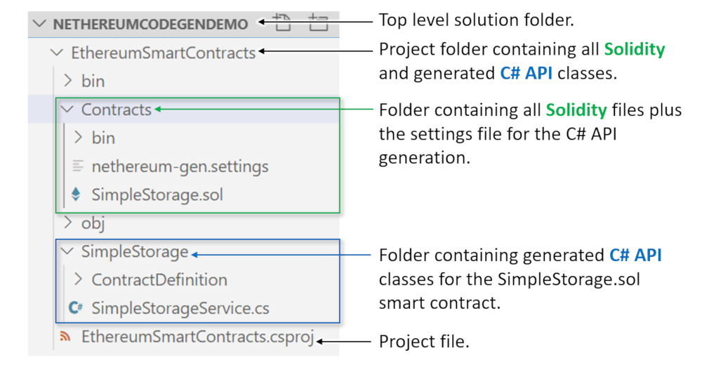
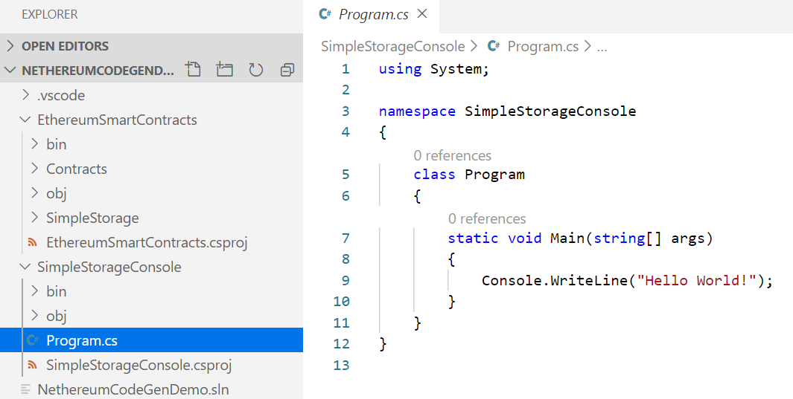

# 使用 Visual Studio Code 生成代码演示

## 前提条件

* 您已安装了 [Visual Studio Code (Windows, Linux or Mac)](https://code.visualstudio.com/).

假设，你的目标是把来自 Solidity的合约叫做
[SimpleStorage.sol](https://solidity.readthedocs.io/en/v0.5.7/introduction-to-smart-contracts.html#storage-example)
并从C#项目中调用其函数。

## 概述
你将在 Visual Studio Code (VS Code) 中准备一个 Solidity 合约并编译它。 编译过程会自动生成一些 C# API 类。 然后可以在 VS Code 或 Visual Studio C# 项目中使用这些类：



上图显示了这些步骤：

 * 编写 Solidity 智能合约并在 VS Code 中编译它们。

 * 为 VS Code 配置 Solidity 插件以自动生成提供对智能合约的访问的 C# API 类。 此配置只需要完成一次。

 * 使用 VS Code 或 Visual Studio 编写 C# 以从生成的 C# API 类调用方法。 此演示将使用 .NET Core 控制台程序来调用 API 类。 在本文档中，术语"函数(function)"指的是 Solidity 函数，"方法(method)"指的是 C# 方法。
## 初始设置

 1. 为顶级解决方案创建一个文件夹。 稍后您将添加一个 `.sln` 解决方案文件。
```shell
md NethereumCodeGenDemo
cd NethereumCodeGenDemo
```

 2. 为合同项目创建一个文件夹。 该项目将保存 Solidity 源文件和与它们相关的生成的 C# API 代码。 稍后将为您生成".csproj"项目文件。
 
 ```shell
md EthereumSmartContracts
cd EthereumSmartContracts
```

 3. 为 Solidity 合约创建一个子文件夹：
```shell
md Contracts
```

 4. 打开 Visual Studio Code.

 5. 如果还没有安装Solidity扩展，打开扩展选项并安装 [Solidity 扩展](https://marketplace.visualstudio.com/items?itemName=JuanBlanco.solidity) 

 6. 使用 VS Code, 打开文件夹 `Contracts`. 最开始, VS Code 只有一个空的树目录:



 7. 无论何时，当VS Code 弹出询问诸如“‘SimpleStorage’中缺少构建和调试所需的资产。 添加他们？”时，选择是的。

 8. 创建一个新的问题件 (ctrl+N).
 
 9. 将以下可靠性代码粘贴到文件中：
```solidity
pragma solidity >=0.4.0 <0.7.0;

contract SimpleStorage {
    uint storedData;

    function set(uint x) public {
        storedData = x;
    }

    function get() public view returns (uint) {
        return storedData;
    }
}
```

 10. 将文件保存到`Contracts` 文件夹下，保存为 `SimpleStorage.sol` 文件，合约代码来自 [Solidity documentation](https://solidity.readthedocs.io/en/v0.5.7/introduction-to-smart-contracts.html#storage-example)
     你可以看到它是一个非常简单的合约，只包含两个函数，`set()` 和 `get()`。 VS Code 应该在树中显示新保存的文件，如下所示：

 

 11. 按下F1，并选择选项 `Solidity: Create 'nethereum-gen.settings' with default values at root`.
     这将创建 Nethereum 设置文件来控制 API 生成。 如果 VS Code 说“市场上有可以帮助处理 .settings 文件的扩展”，请选择“不再显示”。 将设置文件编辑为如下所示，然后保存：
```json
{
    "projectName": "EthereumSmartContracts",
    "namespace": "EthereumSmartContracts.Contracts",
    "lang": 0,
    "autoCodeGen": true,
    "projectPath": "../"
}
```

## 编译合约
您现在已准备好编译合约。
 1. 在 VS Code 中，从树状列表中选择 `SimpleStorage.sol` 文件。
 2. 按下F1 选择选项 `Solidity: Compile Current Solidity Contract`.
    这会编译 Solidity 合约，同时自动生成 C# API 类。 您应该会看到一条消息“编译成功完成”。
 3. 第一次执行上述步骤 2 时，您还需要在生成的项目中升级 Nethereum NuGet 版本。 为此，请在文件夹 `\NethereumCodeGenDemo\EthereumSmartContracts` 中打开命令提示符并输入：

```shell
dotnet add package Nethereum.Web3
```
## 查看您已构建的内容
您现在可以查看到目前为止已构建的内容。 在 VS Code 中，打开顶级解决方案文件夹 `\NethereumCodeGenDemo`，您应该会看到如下所示的树：



现在已编译合约并生成 C# API 类。 生成的`SimpleStorageService`类包含一些与合约交互的有用方法：

| To do this          | Call this C# Method                    |
|---------------------|----------------------------------------|
| Deploy contract     | DeployContractAndWaitForReceiptAsync() |
| Call function set() | SetRequestAndWaitForReceiptAsync()     |
| Call function get() | GetQueryAsync()                        |

请注意，`set()` 和 `get()` 函数调用的 C# 方法命名不同。 这是因为
`set()` 改变了区块链上的一个值，所以它被调用使用一个花费以太币并且可以返回收据的交易。 `get()` 函数不会更改区块链上的任何值，因此它是一个简单的查询调用。 查询是免费的，没有交易也没有收据。

接下来，您将在控制台程序中使用这个新 API。
 
## 创建控制台项目
现在您将创建一个解决方案文件并添加一个控制台项目来试用生成的 API。 在顶级解决方案文件夹 `\NethereumCodeGenDemo` 中打开命令提示符并按照以下步骤操作：

(1.) 创建解决方案文件:
```shell
dotnet new sln --name NethereumCodeGenDemo
```

(2.) 添加新的控制台项目：

```shell
dotnet new console --name SimpleStorageConsole
dotnet sln add .\SimpleStorageConsole\SimpleStorageConsole.csproj
dotnet sln add .\EthereumSmartContracts\EthereumSmartContracts.csproj
```

(3.) 添加对 Console 项目的引用：
```shell
cd SimpleStorageConsole
dotnet add package Nethereum.Web3
dotnet add reference ..\EthereumSmartContracts\EthereumSmartContracts.csproj
```

(4.) 您现在已准备好向 `SimpleStorageConsole` 项目中的 `Program.cs` 文件添加一些代码。 如果您愿意，可以使用 Visual Studio 来执行此操作，但在此演示中将使用 VS Code。 因此，在 VS Code 中，打开顶级解决方案文件夹 `\NethereCodeGenDemo` 并从 `SimpleStorageConsole` 项目中选择 `Program.cs` 文件。 您应该看到如下内容：


(5.) 将下面的代码粘贴到 `Program.cs` 中，替换当前存在的所有内容。 下面的代码使用生成的 C# API 代码（注意 `using EthereumSmartContracts.Contracts.SimpleStorage` 语句）创建一个 `SimpleStorageService` 对象。 然后使用该对象从合约中检索最新的存储值。

```C#
using EthereumSmartContracts.Contracts.SimpleStorage;
using EthereumSmartContracts.Contracts.SimpleStorage.ContractDefinition;
using Nethereum.Web3;
using Nethereum.Web3.Accounts;
using System;
using System.Threading.Tasks;

namespace SimpleStorageConsole
{
    class Program
    {
        static void Main(string[] args)
        {
            Demo().Wait();
        }

        static async Task Demo()
        {
            try
            {
                // Setup
                var url = "https://rinkeby.infura.io/v3/7238211010344719ad14a89db874158c";
                var web3 = new Web3(url);
                // An already-deployed SimpleStorage.sol contract on Rinkeby:
                var contractAddress = "0xb52Fe7D1E04fbf47918Ad8d868103F03Da6ec4fE";
                var service = new SimpleStorageService(web3, contractAddress);

                // Get the stored value
                var currentStoredValue = await service.GetQueryAsync();
                Console.WriteLine($"Contract has value stored: {currentStoredValue}");
            }
            catch (Exception ex)
            {
                Console.WriteLine(ex.ToString());
            }

            Console.WriteLine("Finished");
            Console.ReadLine();
        }
    }
}
```
您现在已准备好构建解决方案并运行上述程序。

## 构建解决方案并运行控制台项目
在顶级解决方案文件夹 `\NethereumCodeGenDemo` 中打开命令提示符并输入：
```shell
dotnet build
```
您最终应该会看到一条消息`Build succeeded`. 下一步:
```shell
cd SimpleStorageConsole
dotnet run
```
输出应类似于以下内容。 实际值 42 取决于最后存储在那里的内容，因此可能不同或为零：

```textmate
Contract has value stored: 42
Finished
```

做得好！ 您已经编写了一个智能合约，为其生成了一个 C# API，并在常规 C# 控制台程序中使用了该 API。

## 还能做什么？
有更多的演示可查看 [Nethereum Playground](http://playground.nethereum.com/).

这个演示的目的是展示代码生成。 但是，您可以尝试扩展此演示中的控制台程序，同时部署`SimpleStorage`合约 并更改其中的存储值。 
这可以使用生成的`SimpleStorageService`类中的其他方法来完成。 为了让你理解，
尝试用下面的代码替换 `Program.cs` 中的 `Demo` 方法，然后运行它：

```C#
static async Task Demo()
{
    try
    {
        // Setup using the Nethereum public test chain
        var url = "http://testchain.nethereum.com:8545";
        var privateKey = "0x7580e7fb49df1c861f0050fae31c2224c6aba908e116b8da44ee8cd927b990b0";
        var account = new Account(privateKey);
        var web3 = new Web3(account, url);

        Console.WriteLine("Deploying...");
        var deployment = new SimpleStorageDeployment();
        var receipt = await SimpleStorageService.DeployContractAndWaitForReceiptAsync(web3, deployment);
        var service = new SimpleStorageService(web3, receipt.ContractAddress);
        Console.WriteLine($"Contract Deployment Tx Status: {receipt.Status.Value}");
        Console.WriteLine($"Contract Address: {service.ContractHandler.ContractAddress}");
        Console.WriteLine("");

        Console.WriteLine("Sending a transaction to the function set()...");
        var receiptForSetFunctionCall = await service.SetRequestAndWaitForReceiptAsync(new SetFunction() { X = 42, Gas = 400000 });
        Console.WriteLine($"Finished storing an int: Tx Hash: {receiptForSetFunctionCall.TransactionHash}");
        Console.WriteLine($"Finished storing an int: Tx Status: {receiptForSetFunctionCall.Status.Value}");
        Console.WriteLine("");

        Console.WriteLine("Calling the function get()...");
        var intValueFromGetFunctionCall = await service.GetQueryAsync();
        Console.WriteLine($"Int value: {intValueFromGetFunctionCall} (expecting value 42)");
        Console.WriteLine("");
    }
    catch (Exception ex)
    {
        Console.WriteLine(ex.ToString());
    }

    Console.WriteLine("Finished");
    Console.ReadLine();
}
```     


 
