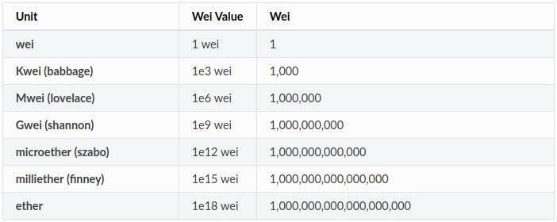

# 使用 Nethereum 转换加密货币单位

有关 Nethereum 的文档可在以下位置找到 <https://docs.nethereum.com>

本文档将引导您了解用于转换以太坊货币单位的 Nethereum 方法。

## 加密货币单位入门

加密货币提供了几个价值单位，以便准确地操纵大小金额，就像一个人可以根据交易金额计算以美分或美元为单位的金额一样。

以下是 **Ether** 的单位细分：



现在我们已经介绍了以太坊中加密货币单位的基础知识，让我们准备我们的环境以与链交互并使用实时代码进行学习：

!!! 注意
    您还可以通过Nethereum's playground直接在浏览器上运行代码。
    [Ether: Unit conversion between Ether and Wei](http://playground.nethereum.com/csharp/id/1014)

## 快速演练配置

首先，让我们下载与您的环境匹配的测试链： <https://github.com/Nethereum/Testchains>

使用 **startgeth.bat** (Windows) 或 **startgeth.sh** 启动 Geth 链（geth-clique-linux\、geth-clique-windows\ 或 geth-clique-mac\）(Mac /Linux)。 该链是通过权威证明共识(POA)建立的，并将立即开始Mining过程。

```C#
using Nethereum.Web3;
```

```C#
using Nethereum.Web3.Accounts;
```

之后，我们需要基于这个新账户创建一个 web3 实例：

```C#
var web3 = new Web3();
```

现在我们的环境已经设置好了，让我们开始在不同的单元中创建事务：

## 处理单位

首先，让我们检查我们链中配置的一个帐户的余额，为此，我们可以异步执行 GetBalance 请求：

```C#
var balance = await web3.Eth.GetBalance.SendRequestAsync("0x12890d2cce102216644c59daE5baed380d84830c");
```

默认情况下，返回值以 Wei（值的最低单位）为单位，不一定容易阅读，除非您在数学方面非常有天赋：

```C#
var balanceInWei = balance.Value;
```

为了使其更人性化，我们可以使用转换实用程序的“**FromWei**”方法将余额转换为 Ether：

```C#
var balanceInEther = Web3.Convert.FromWei(balance.Value);
```

我们还可以使用“**ToWei**”方法将余额“反向转换”回wei（当然，这只是为了演示该方法）：

```C#
var BackToWei = Web3.Convert.ToWei(balanceInEther);
```
