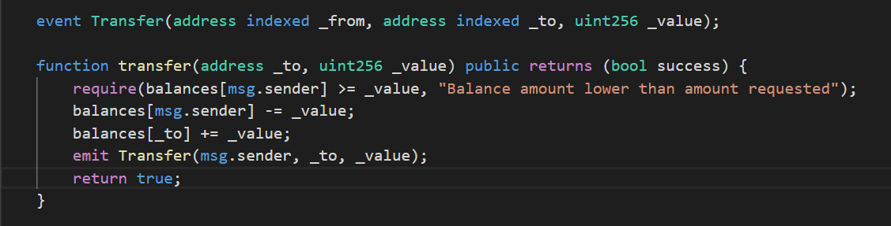

## 智能合约 事件(Events),日志(Logs)和筛选器(Filters)

事件时智能合约在转账凭证内写入的日志信息，它提供了一种获取有关智能合约交易的额外信息的方法。

一个很好的例子是 ERC20 标准代币合约中的“Transfer”事件。 每次发生代币转移时，都会记录一个事件，提供“发送者”、“接收者”和转移代币数量的信息。



上面我们可以看到带有不同索引参数的事件声明，这些将允许我们稍后“过滤”特定事件。 例如，特定接收方地址“_to”的“Transfer”事件。

Transfer 事件可以在以“emit”关键字为前缀的函数中看到。

!!! 注意
    您还可以直接在浏览器中运行类似的代码
    通过以下链接使用 Nethereum's playground：
    [Smart Contracts: Events (End to End Introduction)](http://playground.nethereum.com/csharp/id/1008)
    [Smart Contracts: Events (Retrieving Events from Chain)](http://playground.nethereum.com/csharp/id/1009)

### 前提条件

首先，我们需要声明我们的命名空间和合约定义以与智能合约交互。 在这个场景中，我们只对 ERC20 智能合约的 Deployment、Transfer 函数和 Transfer Event 感兴趣。

```C#
using Nethereum.Web3;
using Nethereum.ABI.FunctionEncoding.Attributes;
using Nethereum.Contracts.CQS;
using Nethereum.Util;
using Nethereum.Web3.Accounts;
using Nethereum.Hex.HexConvertors.Extensions;
using Nethereum.Contracts;
using Nethereum.Contracts.Extensions;
using System.Numerics;
```
为了部署合约，我们将创建一个继承自 ContractDeploymentMessage 的类，在这里我们可以包含我们编译的字节码和其他构造函数参数。

正如我们在下面看到的，StandardToken 部署消息包括 ERC20 智能合约的编译字节码和带有“totalSupply”代币的构造函数参数。

每个参数都用一个属性 Parameter 进行描述，包括其名称“totalSupply”、类型“uint256”和顺序"order"。

```c#
public class StandardTokenDeployment : ContractDeploymentMessage
{

    public static string BYTECODE = "0x60606040526040516020806106f5833981016040528080519060200190919050505b80600160005060003373ffffffffffffffffffffffffffffffffffffffff16815260200190815260200160002060005081905550806000600050819055505b506106868061006f6000396000f360606040523615610074576000357c010000000000000000000000000000000000000000000000000000000090048063095ea7b31461008157806318160ddd146100b657806323b872dd146100d957806370a0823114610117578063a9059cbb14610143578063dd62ed3e1461017857610074565b61007f5b610002565b565b005b6100a060048080359060200190919080359060200190919050506101ad565b6040518082815260200191505060405180910390f35b6100c36004805050610674565b6040518082815260200191505060405180910390f35b6101016004808035906020019091908035906020019091908035906020019091905050610281565b6040518082815260200191505060405180910390f35b61012d600480803590602001909190505061048d565b6040518082815260200191505060405180910390f35b61016260048080359060200190919080359060200190919050506104cb565b6040518082815260200191505060405180910390f35b610197600480803590602001909190803590602001909190505061060b565b6040518082815260200191505060405180910390f35b600081600260005060003373ffffffffffffffffffffffffffffffffffffffff16815260200190815260200160002060005060008573ffffffffffffffffffffffffffffffffffffffff168152602001908152602001600020600050819055508273ffffffffffffffffffffffffffffffffffffffff163373ffffffffffffffffffffffffffffffffffffffff167f8c5be1e5ebec7d5bd14f71427d1e84f3dd0314c0f7b2291e5b200ac8c7c3b925846040518082815260200191505060405180910390a36001905061027b565b92915050565b600081600160005060008673ffffffffffffffffffffffffffffffffffffffff168152602001908152602001600020600050541015801561031b575081600260005060008673ffffffffffffffffffffffffffffffffffffffff16815260200190815260200160002060005060003373ffffffffffffffffffffffffffffffffffffffff1681526020019081526020016000206000505410155b80156103275750600082115b1561047c5781600160005060008573ffffffffffffffffffffffffffffffffffffffff1681526020019081526020016000206000828282505401925050819055508273ffffffffffffffffffffffffffffffffffffffff168473ffffffffffffffffffffffffffffffffffffffff167fddf252ad1be2c89b69c2b068fc378daa952ba7f163c4a11628f55a4df523b3ef846040518082815260200191505060405180910390a381600160005060008673ffffffffffffffffffffffffffffffffffffffff16815260200190815260200160002060008282825054039250508190555081600260005060008673ffffffffffffffffffffffffffffffffffffffff16815260200190815260200160002060005060003373ffffffffffffffffffffffffffffffffffffffff1681526020019081526020016000206000828282505403925050819055506001905061048656610485565b60009050610486565b5b9392505050565b6000600160005060008373ffffffffffffffffffffffffffffffffffffffff1681526020019081526020016000206000505490506104c6565b919050565b600081600160005060003373ffffffffffffffffffffffffffffffffffffffff168152602001908152602001600020600050541015801561050c5750600082115b156105fb5781600160005060003373ffffffffffffffffffffffffffffffffffffffff16815260200190815260200160002060008282825054039250508190555081600160005060008573ffffffffffffffffffffffffffffffffffffffff1681526020019081526020016000206000828282505401925050819055508273ffffffffffffffffffffffffffffffffffffffff163373ffffffffffffffffffffffffffffffffffffffff167fddf252ad1be2c89b69c2b068fc378daa952ba7f163c4a11628f55a4df523b3ef846040518082815260200191505060405180910390a36001905061060556610604565b60009050610605565b5b92915050565b6000600260005060008473ffffffffffffffffffffffffffffffffffffffff16815260200190815260200160002060005060008373ffffffffffffffffffffffffffffffffffffffff16815260200190815260200160002060005054905061066e565b92915050565b60006000600050549050610683565b9056";

    public StandardTokenDeployment() : base(BYTECODE){}

    [Parameter("uint256", "totalSupply")]
    public BigInteger TotalSupply { get; set; }
}
```

我们可以调用智能合约的函数来查询智能合约的状态或进行任何计算，不会影响区块链的状态。

为此，我们需要创建一个继承自“FunctionMessage”的类。 首先，我们将使用“Function”属性装饰类，包括名称和返回类型。

函数的每个参数都将是类的一个属性，每个参数都装饰有“参数”属性，包括智能合约名称、类型和参数顺序。

对于 ERC20 智能合约，“balanceOf”函数定义，提供查询接口来获取给定地址的代币余额。 正如我们所见，这个函数只包含一个“地址”类型的参数“_owner”。

```C#
[Function("balanceOf", "uint256")]
public class BalanceOfFunction : FunctionMessage
{
    [Parameter("address", "_owner", 1)]
    public string Owner { get; set; }
}
```

另一种类型的智能合约功能将对应于将改变智能合约状态的交易。

例如ERC20智能合约的“转账”函数定义，包括参数“\_to”地址参数作为字符串，以及我们要转账的“\_value”或TokenAmount。

与“balanceOf”函数类似，所有参数包括solidity类型、参数名称和参数顺序。

注意：使用函数时，参数类型和函数名称正确非常重要，因为所有这些都构成了函数的签名。

```C#
[Function("transfer", "bool")]
public class TransferFunction : FunctionMessage
{
    [Parameter("address", "_to", 1)]
    public string To { get; set; }

    [Parameter("uint256", "_value", 2)]
    public BigInteger TokenAmount { get; set; }
}
```

最后，智能合约也有事件。 智能合约中的事件写入区块链日志，提供了一种检索发生的任何智能合约交互的扩展信息的方法。

要创建事件定义，我们需要创建一个继承自 IEventDTO 的类，并使用 Event 属性进行修饰。

转账事件，与函数类似，它也包括名称、顺序和类型的参数。 但另外需要一个布尔值，它表示参数是否被索引。

索引参数将允许我们稍后在区块链中查询这些值。

```C#
[Event("Transfer")]
public class TransferEventDTO : IEventDTO
{
    [Parameter("address", "_from", 1, true)]
    public string From { get; set; }

    [Parameter("address", "_to", 2, true)]
    public string To { get; set; }

    [Parameter("uint256", "_value", 3, false)]
    public BigInteger Value { get; set; }
}
```

### 实例化 Web3 和帐户

运行此实例的一个简单的方式时连接到一个预配置的测试链 https://github.com/Nethereum/TestChains (Geth, Parity, Ganache) ，使用账户私钥为为：“0xb5b1870957d373ef0eeffecc6e4812c0fd08f554b37b233526acc331bf1544f7”
的账户“0x12890d2cce102216644c59daE5baed380d84830c”，或者使用您自己的测试链和您自己的帐户/私钥。

要创建 web3 的实例，我们首先提供我们的测试链的 url 和我们帐户的私钥。 当提供一个使用私钥实例化的帐户时，我们所有的交易都将由 Nethereum “离线”签署。

```C#
var url = "http://localhost:8545";
var privateKey = "0xb5b1870957d373ef0eeffecc6e4812c0fd08f554b37b233526acc331bf1544f7";
var account = new Account(privateKey);
var web3 = new Web3(account, url);
```

### 部署合约

下一步是部署我们的标准代币 ERC20 智能合约，在这种情况下，总供应量（代币数量）将是 100,000。

首先，我们创建一个具有 TotalSupply 数量的 StandardTokenDeployment 实例。

```C#
var deploymentMessage = new StandardTokenDeployment
{
    TotalSupply = 100000
};
```

然后我们使用我们的合约部署定义创建一个部署处理程序，并使用部署消息简单地部署合约。 
我们使用自动的方式估算 gas，获取最新的 gas 价格和 nonce，因此在部署消息上没有设置任何其他内容。

最后，我们等待部署交易被打包，并从收据中检索新合约的合约地址。

```C#
var deploymentHandler = web3.Eth.GetContractDeploymentHandler<StandardTokenDeployment>();
var transactionReceipt = await deploymentHandler.SendRequestAndWaitForReceiptAsync(deploymentMessage);
var contractAddress = transactionReceipt.ContractAddress;
```

### 转账

一旦我们部署了合约，我们就可以执行我们的第一个转账交易。 transfer函数会将转账事件写入日志。

首先，我们可以使用 TrasferFunction 定义和 TransferFunction 消息创建一个 TransactionHandler，
其中包括“receiverAddress”和我们要发送的Token数量。

最后进行交易转账，等待交易被“打包”并包含在区块链中。

```C#
var receiverAddress = "0xde0B295669a9FD93d5F28D9Ec85E40f4cb697BAe";
var transferHandler = web3.Eth.GetContractTransactionHandler<TransferFunction>();
var transfer = new TransferFunction()
{
    To = receiverAddress,
    TokenAmount = 100
};
var transactionReceipt = await transferHandler.SendRequestAndWaitForReceiptAsync(contractAddress, transfer);
```

## 从 TransactionReceipt 解码事件

事件日志是 TransactionReceipts 的一部分，因此使用来自先前传输的 Transaction 凭证，我们可以使用扩展方法`DecodeAllEvents<TransferEventDTO>()`对 TransferEvent 进行解码。

请注意，此方法返回解码传输事件数组而不是单个值，因为收据可以包含多个相同签名的事件。

```C#
var transferEventOutput = transactionReceipt.DecodeAllEvents<TransferEventDTO>();
```

## 合约过滤器和事件日志

访问智能合约事件日志的另一种方法是获取日志的所有更改（提供过滤器消息）或创建过滤器并检索定期应用于我们的过滤器消息的更改。\

要访问日志，首先，我们需要为我们的合约地址和事件定义（TransferEventDTO）创建一个传输事件处理程序。

```C#
var transferEventHandler = web3.Eth.GetEvent<TransferEventDTO>(contractAddress);
```

使用事件处理程序，我们可以使用默认值为我们的传输事件创建过滤器消息。

BlockParameters 的默认值为 Earliest 和 Latest，因此当我们检索日志时，我们将获取从该合约的第一个块到最新块的所有传输事件。

```C#
var filterAllTransferEventsForContract = transferEventHandler.CreateFilterInput();
```

创建消息后，我们可以使用事件和 GetAllChanges 检索所有日志。 当前实例下，因为我们只进行了一次传输，所以我们将只有一个 Transfer Event。

```C#
var allTransferEventsForContract = await transferEventHandler.GetAllChanges(filterAllTransferEventsForContract);
```

如果我们现在再次转移到不同的地址

```C#
var receiverAddress2 = "0x3e0B295669a9FD93d5F28D9Ec85E40f4cb697BAe";
var transfer2 = new TransferFunction()
{
    To = receiverAddress2,
    TokenAmount = 1000
};
var transactionReceipt2 = await transferHandler.SendRequestAndWaitForReceiptAsync(contractAddress, transfer2);
```

使用相同的过滤器输入消息并再次调用 GetAllChanges，我们现在将获得两个传输事件日志。

```C#
var allTransferEventsForContract2 = await transferEventHandler.GetAllChanges(filterAllTransferEventsForContract);
```

过滤消息可以将结果（类似于块范围）限制为索引参数，例如我们可以为我们的发送者地址和接收者地址创建一个过滤器。 提醒一下，我们的事件将“_from”地址和“_to”地址作为索引参数。

```C#
var filterTransferEventsForContractReceiverAddress2 = transferEventHandler.CreateFilterInput(account.Address, receiverAddress2);
var transferEventsForContractReceiverAddress2 = await transferEventHandler.GetAllChanges(filterTransferEventsForContractReceiverAddress2);
```

过滤器值的顺序基于事件参数的顺序，如果我们想包括所有到“receiverAddress2”的转账，则需要将账户地址设置为空才能被忽略。

```C#
var filterTransferEventsForContractAllReceiverAddress2 = transferEventHandler.CreateFilterInput<string, string>(null, receiverAddress2);
var transferEventsForContractAllReceiverAddress2 = await transferEventHandler.GetAllChanges(filterTransferEventsForContractAllReceiverAddress2);
```

另一种情况是当您想要包含多个索引值时，例如“receiverAddress1”或“receiverAddress2”的传输。 然后，您将需要使用您感兴趣的值的数组。

```C#
var filterTransferEventsForContractAllReceiverAddresses = transferEventHandler.CreateFilterInput(null, new []{receiverAddress2, receiverAddress});
var transferEventsForContractAllReceiverAddresses = await transferEventHandler.GetAllChanges(filterTransferEventsForContractAllReceiverAddresses);
```

### 创建过滤器以检索定期更改

另一种选择是创建过滤器，只返回我们获得先前结果后发生的更改。 这消除了跟踪检查事件的最后一个块并将其委托给以太坊客户端的需求。

使用我们在创建过滤器并获取 filterId 之前创建的相同过滤器消息。

```C#
var filterIdTransferEventsForContractAllReceiverAddress2  = await transferEventHandler.CreateFilterAsync(filterTransferEventsForContractAllReceiverAddress2);
```

需要注意的一点是，如果现在尝试获取过滤器更改，我们将不会得到任何结果，因为过滤器仅返回自创建以来的更改。

```C#
var result = await transferEventHandler.GetFilterChanges(filterIdTransferEventsForContractAllReceiverAddress2);
```

但是，如果我们使用相同的值进行另一次传输

```C#
await transferHandler.SendRequestAndWaitForReceiptAsync(contractAddress, transfer2);
```

并使用相同的过滤器 id 执行获取过滤器更改，我们将获取上一次传输的事件。

```C#
var result = await transferEventHandler.GetFilterChanges(filterIdTransferEventsForContractAllReceiverAddress2);
```

再次执行相同的操作将不会返回任何结果，因为自上次执行 GetFilterChanges 以来没有发生新的传输。

```C#
var result = await transferEventHandler.GetFilterChanges(filterIdTransferEventsForContractAllReceiverAddress2);
```

## 所有合约的事件

不同的合约可以拥有并引发/记录具有相同签名的相同事件，一个简单的例子是作为以太坊一部分的多个标准代币 ERC20 智能合约。 在某些情况下，您可能希望使用特定过滤器捕获不同合约的所有事件，例如所有转移到一个地址。

在 Nethereum 创建一个没有合约地址的事件（处理程序）允许创建不附加到特定合约的过滤器。

```C#
var transferEventHandlerAnyContract = web3.Eth.GetEvent<TransferEventDTO>();
```

在前面的示例，链中已经部署了一个合约，因此为了演示对多个合约的事件的访问，我们可以部署另一个标准令牌合约。

```C#
var transactionReceiptNewContract = await deploymentHandler.SendRequestAndWaitForReceiptAsync(deploymentMessage);
var contractAddress2 = transactionReceiptNewContract.ContractAddress;
```

并使用这个新合约和相同的接收方地址进行另一次转账。

```C#
await transferHandler.SendRequestAndWaitForReceiptAsync(contractAddress2, transfer);
```

创建默认过滤器输入并获取所有更改，将检索所有合约的所有传输事件。

```C#
var filterAllTransferEventsForAllContracts = transferEventHandlerAnyContract.CreateFilterInput();
var allTransferEventsForContract = await transferEventHandlerAnyContract.GetAllChanges(filterAllTransferEventsForAllContracts);
```

如果我们只想检索到“receiverAddress”的所有转账，我们可以创建与以前相同的过滤器，仅包括第二个索引参数（“to”）。 这将两个合同的转移返回到此地址。

```C#
var filterTransferEventsForAllContractsReceiverAddress2 = transferEventHandlerAnyContract.CreateFilterInput<string, string>(null, receiverAddress);
await transferEventHandlerAnyContract.GetAllChanges(filterTransferEventsForAllContractsReceiverAddress2);
```
