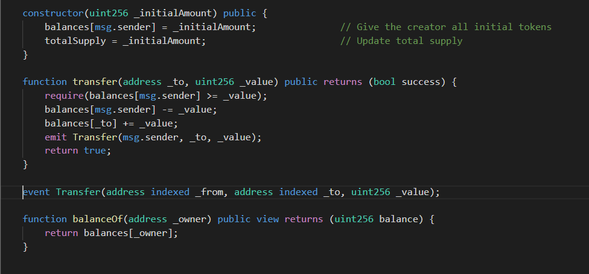

# Nethereum 与智能合约的集成

此示例的目的如下:

* 了解如何创建一个合约部署，并与智能合约的功能和事件进行交。

* 使用私钥创建帐户对象，允许“离线”签署交易。

* 部署智能合约（提供的样本是标准的 ERC20 代币合约）

* 调用智能合约（在这里是获取账户余额）

* 向智能合约发送交易（在这里是转移余额）

* 估算合约交易的 gas 成本

* Gas费，随机数(Nonces)和发送Eth到智能合约

* 签署在线/离线交易功能消息和部署消息。

* 为 Deployment 和 Function messages提供扩展方法。

* 从前一个区块中检索智能合约的状态

### 前置条件

在本教程中，我们将与 ERC20 标准代币合约进行交互。 智能合约提供了一种创建新代币、将其转移到另一个账户并查询任何账户余额的标准方法。 
这个标准接口允许提供相同的签名的应用程序与智能合约进行交互。



!!! 注意
    你可以在Nethereum's playground 中，使用浏览器运行相关示例： http://playground.nethereum.com/csharp/id/1007

首先，我们需要声明我们的命名空间，以及与智能合约交互的合约定义。 
在当前场景中，我们只对 ERC20 智能合约的 Deployment、Transfer 函数和 BalanceOf Function 进行实现。

```C#
using Nethereum.Web3;
using Nethereum.ABI.FunctionEncoding.Attributes;
using Nethereum.Contracts.CQS;
using Nethereum.Util;
using Nethereum.Web3.Accounts;
using Nethereum.Hex.HexConvertors.Extensions;
using Nethereum.Contracts;
using Nethereum.Contracts.Extensions;
using System.Numerics;
```

为了部署合约，我们将创建一个继承自 ContractDeploymentMessage 的类，在这里我们可以包含我们编译的字节码和其他构造函数参数。

正如我们在下面看到的，StandardToken 部署消息包括 ERC20 智能合约的编译字节码和带有"totalSupply"代币的构造函数参数。

每个参数都用一个属性 Parameter 进行描述，包括其名称"totalSupply"、类型"uint256"和顺序"order"。
```C#
public class StandardTokenDeployment : ContractDeploymentMessage
{

    public static string BYTECODE = "0x60606040526040516020806106f5833981016040528080519060200190919050505b80600160005060003373ffffffffffffffffffffffffffffffffffffffff16815260200190815260200160002060005081905550806000600050819055505b506106868061006f6000396000f360606040523615610074576000357c010000000000000000000000000000000000000000000000000000000090048063095ea7b31461008157806318160ddd146100b657806323b872dd146100d957806370a0823114610117578063a9059cbb14610143578063dd62ed3e1461017857610074565b61007f5b610002565b565b005b6100a060048080359060200190919080359060200190919050506101ad565b6040518082815260200191505060405180910390f35b6100c36004805050610674565b6040518082815260200191505060405180910390f35b6101016004808035906020019091908035906020019091908035906020019091905050610281565b6040518082815260200191505060405180910390f35b61012d600480803590602001909190505061048d565b6040518082815260200191505060405180910390f35b61016260048080359060200190919080359060200190919050506104cb565b6040518082815260200191505060405180910390f35b610197600480803590602001909190803590602001909190505061060b565b6040518082815260200191505060405180910390f35b600081600260005060003373ffffffffffffffffffffffffffffffffffffffff16815260200190815260200160002060005060008573ffffffffffffffffffffffffffffffffffffffff168152602001908152602001600020600050819055508273ffffffffffffffffffffffffffffffffffffffff163373ffffffffffffffffffffffffffffffffffffffff167f8c5be1e5ebec7d5bd14f71427d1e84f3dd0314c0f7b2291e5b200ac8c7c3b925846040518082815260200191505060405180910390a36001905061027b565b92915050565b600081600160005060008673ffffffffffffffffffffffffffffffffffffffff168152602001908152602001600020600050541015801561031b575081600260005060008673ffffffffffffffffffffffffffffffffffffffff16815260200190815260200160002060005060003373ffffffffffffffffffffffffffffffffffffffff1681526020019081526020016000206000505410155b80156103275750600082115b1561047c5781600160005060008573ffffffffffffffffffffffffffffffffffffffff1681526020019081526020016000206000828282505401925050819055508273ffffffffffffffffffffffffffffffffffffffff168473ffffffffffffffffffffffffffffffffffffffff167fddf252ad1be2c89b69c2b068fc378daa952ba7f163c4a11628f55a4df523b3ef846040518082815260200191505060405180910390a381600160005060008673ffffffffffffffffffffffffffffffffffffffff16815260200190815260200160002060008282825054039250508190555081600260005060008673ffffffffffffffffffffffffffffffffffffffff16815260200190815260200160002060005060003373ffffffffffffffffffffffffffffffffffffffff1681526020019081526020016000206000828282505403925050819055506001905061048656610485565b60009050610486565b5b9392505050565b6000600160005060008373ffffffffffffffffffffffffffffffffffffffff1681526020019081526020016000206000505490506104c6565b919050565b600081600160005060003373ffffffffffffffffffffffffffffffffffffffff168152602001908152602001600020600050541015801561050c5750600082115b156105fb5781600160005060003373ffffffffffffffffffffffffffffffffffffffff16815260200190815260200160002060008282825054039250508190555081600160005060008573ffffffffffffffffffffffffffffffffffffffff1681526020019081526020016000206000828282505401925050819055508273ffffffffffffffffffffffffffffffffffffffff163373ffffffffffffffffffffffffffffffffffffffff167fddf252ad1be2c89b69c2b068fc378daa952ba7f163c4a11628f55a4df523b3ef846040518082815260200191505060405180910390a36001905061060556610604565b60009050610605565b5b92915050565b6000600260005060008473ffffffffffffffffffffffffffffffffffffffff16815260200190815260200160002060005060008373ffffffffffffffffffffffffffffffffffffffff16815260200190815260200160002060005054905061066e565b92915050565b60006000600050549050610683565b9056";

    public StandardTokenDeployment() : base(BYTECODE){}

    [Parameter("uint256", "totalSupply")]
    public BigInteger TotalSupply { get; set; }
}
```

我们可以调用智能合约的函数来查询智能合约的状态或进行任何计算，不会影响区块链的状态。

为此，我们需要创建一个继承自"FunctionMessage"的类。 首先，我们将使用"Function"属性装饰该类，包括名称和返回类型，如下面的代码片段所示。

函数的每个参数都将是类的一个属性，每个参数都装饰有“参数”属性，包括智能合约名称、类型和参数顺序。

对于 ERC20 智能合约，"balanceOf"函数定义，提供查询接口来获取给定地址的代币余额。 正如我们所见，这个函数只包含一个"Address"类型的参数"_owner"。
```C#
[Function("balanceOf", "uint256")]
public class BalanceOfFunction : FunctionMessage
{
    [Parameter("address", "_owner", 1)]
    public string Owner { get; set; }
}
```

另一种类型的智能合约功能是一个改变智能合约状态的交易。

对于示例的ERC20智能合约的"Transfer"函数定义，包括一个字符串"_to"的地址类型参数，以及我们要转账的"_value"或TokenAmount参数。

与“balanceOf”函数类似，所有参数包括solidity类型、参数名称和参数顺序。

!!! 注意:使用函数时，确保参数类型和函数名称正确非常重要，因为所有这些都构成了函数的签名。

```C#
[Function("transfer", "bool")]
public class TransferFunction : FunctionMessage
{
    [Parameter("address", "_to", 1)]
    public string To { get; set; }

    [Parameter("uint256", "_value", 2)]
    public BigInteger TokenAmount { get; set; }
}
```

最后，智能合约也有事件。 智能合约中的事件写入区块链日志，它提供了一种检索智能合约交互时，一切与之产生信息的方法。

要创建事件定义，我们需要创建一个继承自 IEventDTO 的类，并使用 Event 属性进行修饰。

转账的事件，与函数类似，它也包括名称、顺序和类型的参数。 此外，还有一个布尔值，指示参数是否被索引。

索引参数将允许我们稍后在区块链中查询这些值。

```C#
[Event("Transfer")]
public class TransferEventDTO : IEventDTO
{
    [Parameter("address", "_from", 1, true)]
    public string From { get; set; }

    [Parameter("address", "_to", 2, true)]
    public string To { get; set; }

    [Parameter("uint256", "_value", 3, false)]
    public BigInteger Value { get; set; }
}
```

### 实例化 Web3 和 Account

要创建 web3 的实例，我们首先提供我们的测试链的 url 和我们帐户的私钥。
这里我们使用 http://testchain.nethereum.com:8545，这是我们简单的单节点 Nethereum 测试链。
当提供一个使用私钥实例化的账户时，我们所有的交易都将由 Nethereum 签名。

```C#
var url = "http://testchain.nethereum.com:8545";
var privateKey = "0x7580e7fb49df1c861f0050fae31c2224c6aba908e116b8da44ee8cd927b990b0";
var account = new Account(privateKey);
var web3 = new Web3(account, url);
```

### 部署合约

在线查找可执行示例 [ Nethereum playground ](http://playground.nethereum.com/csharp/id/1006).

下一步是部署我们的标准代币 ERC20 智能合约，在这种情况下，总供应量（代币数量）将是 100,000。

首先，我们创建一个具有 TotalSupply 数量的 StandardTokenDeployment 实例。

```C#
var deploymentMessage = new StandardTokenDeployment
{
    TotalSupply = 100000
};
```

然后我们使用我们的合约部署定义创建一个部署处理程序，并使用部署消息简单地部署合约。 我们正在自动估算 gas，获取最新的 gas 价格和 nonce，因此在部署消息上没有设置任何其他内容。

最后，我们等待部署交易被打包(Mined)，并从收据中检索新合约的合约地址。

```C#
var deploymentHandler = web3.Eth.GetContractDeploymentHandler<StandardTokenDeployment>();
var transactionReceipt = await deploymentHandler.SendRequestAndWaitForReceiptAsync(deploymentMessage);
var contractAddress = transactionReceipt.ContractAddress;
```

### 与合约交互

一旦我们部署了合约，我们就可以开始与合约交互了。

#### 查询


要检索地址的余额，我们可以创建 BalanceFunction 消息的实例并将参数设置为我们的帐户"Address"，因为我们是令牌的"所有者"，并且在部署合约时已将全部余额分配给我们，所以查询到的余额将会是全部供应量。
```C#
var balanceOfFunctionMessage = new BalanceOfFunction()
{
    Owner = account.Address,
};

var balanceHandler = web3.Eth.GetContractQueryHandler<BalanceOfFunction>();
var balance = await balanceHandler.QueryAsync<BigInteger>(contractAddress, balanceOfFunctionMessage);
```

要检索余额，我们将创建一个 QueryHandler，最后使用我们的合约地址和消息检索余额金额。


#### 多种返回类型或复杂对象

智能合约的函数可以在一次调用中返回一个或多个值。 为了解码返回值，我们使用 FunctionOutputDTO。

函数输出是用 FunctionOutput 属性修饰并实现接口 IFunctionOutputDTO 的类。

下面这个实例适用于在 ERC20 智能合约上返回余额的单个值。

```C#
 [FunctionOutput]
 public class BalanceOfOutputDTO : IFunctionOutputDTO
 {
      [Parameter("uint256", "balance", 1)]
      public BigInteger Balance { get; set; }
 }
```

如果我们需要返回多个值，类似于:

```C#
 [FunctionOutput]
 public class BalanceOfOutputMultipleDTO : IFunctionOutputDTO
 {
      [Parameter("uint256", "balance1", 1)]
      public BigInteger Balance1 { get; set; }

      [Parameter("uint256", "balance2", 2)]
      public BigInteger Balance2 { get; set; }

      [Parameter("uint256", "balance1", 3)]
      public BigInteger Balance3 { get; set; }
 }
```

在查询链时，我们将使用以下方法：

```C#
var balance = await balanceHandler.QueryDeserializingToObjectAsync<BalanceOfOutputDTO>( balanceOfFunctionMessage, contractAddress);
```

#### 查询智能合约的先前状态

以太坊区块链的另一个重要功能是能够从前一个区块中检索智能合约的状态。

例如，我们可以使用部署合约的区块号来获取部署时所有者的余额。

```C#
var balance = await balanceHandler.QueryDeserializingToObjectAsync<BalanceOfOutputDTO>( balanceOfFunctionMessage, contractAddress, new Nethereum.RPC.Eth.DTOs.BlockParameter(transactionReceipt.BlockNumber));
```

#### 交易

进行交易会改变区块链的状态，所以在这个场景中，我们需要使用 TransferFunction 定义创建一个 TransactionHandler。

在转账消息中，我们将包含接收方地址“To”，以及要转账的“TokenAmount”。

最后一步是发送请求并等待收据被"打包"并包含在区块链中。

另一种选择是不等待（轮询）交易被挖掘，而只是检索交易哈希。

```C#
var receiverAddress = "0xde0B295669a9FD93d5F28D9Ec85E40f4cb697BAe";
var transferHandler = web3.Eth.GetContractTransactionHandler<TransferFunction>();
var transfer = new TransferFunction()
{
    To = receiverAddress,
    TokenAmount = 100
};
var transactionReceipt = await transferHandler.SendRequestAndWaitForReceiptAsync(contractAddress, transfer);
```

#### 将以ETH移到智能合约

函数或部署交易可以将ETH发送到智能合约。FunctionMessage 和 DeploymentMessage 具有属性"AmountToSend"。

因此，如果"transfer"函数也接受以太币，我们将以这种方式设置它。

```C#
transfer.AmountToSend = Nethereum.Web3.Web3.Convert.ToWei(1);
```

GasPrice 设置为以太坊中最低的单位"Wei"，因此在上面的场景中，我们将 1 Ether 转换为 Wei。

#### Gas 费

如果没有通过使用客户端的“GasPrice”调用来提供Gas费设置，Nethereum 会自动设置 GasPrice，该方法提供之前区块的平均 gas 价格。

如果您想更好地控制 GasPrice，可以在 FunctionMessages 和 DeploymentMessages 中进行设置。

```C#
transfer.GasPrice =  Nethereum.Web3.Web3.Convert.ToWei(25, UnitConversion.EthUnit.Gwei);
```

GasPrice 设置为以太坊中最低的单位“Wei”，因此如果我们习惯了通常的“Gwei”单位，则需要使用 Nethereum 转换函数进行转换。

#### Gas估算

Nethereum 通过使用“CallInput”在内部调用“EthEstimateGas”来自动估计进行函数交易所需的总Gas。

如果需要，可以使用 TransactionHandler 和"transfer" 和 FucntionMessage 手动完成。

```C#
 var estimate = await transferHandler.EstimateGasAsync(contractAddress, transfer);
 transfer.Gas = estimate.Value;
```

在 [ Nethereum playground ](http://playground.nethereum.com/csharp/id/1010) 上找到上述的可执行示例。

#### 交易随机数(Nonces)

每个帐户交易都有一个与之关联的 Nonce，这是该交易的顺序和唯一编号。 这允许每笔交易彼此区分开来，也确保交易以相同的顺序处理。

Nethereum 通过从链中检索交易的最新计数来自动计算所有交易的 Nonce。 还在帐户级别内部管理随机数上的内存中拥有一个计数器，以允许我们在给以太坊客户端发送多个交易之前更新其内部计数器。

然而，在某些情况下，我们可能自己提供 Nonce定义，例如，如果我们想要完全离线签署交易。

```C#
transfer.Nonce = 2;
```

#### 函数签名 / 在线部署消息 / 离线

TransactionHandler 还提供了一种机制来签署 Function 和 Deployments 消息，前提是我们使用 Account 和 ExternalAccount 或者ExternalAccount。

```C#
var signedTransaction = await transferHandler.SignTransactionAsync(ContractAddress, transfer);
```

Nethereum 内部调用以太坊客户端来设置 GasPrice、Nonce 并估算 Gas，因此如果想要完全离线签署合约的交易，我们需要事先设置这些值。

```C#
transfer.Nonce = 2;
transfer.Gas = 21000;
transfer.GasPrice =  Nethereum.Web3.Web3.Convert.ToWei(25, UnitConversion.EthUnit.Gwei);
var signedTransaction = await transferHandler.SignTransactionAsync(ContractAddress, transfer);
```

在 [ Nethereum playground ](http://playground.nethereum.com/csharp/id/1011) 上找到上述的可执行示例。

#### 函数和部署消息的扩展方法

有许多扩展可以简化与 Function 消息和 Deployment 消息的交互。

这些在命名空间下

```C#
using Nethereum.Contracts.Extensions;
```

一些扩展方法如下：

**SetGasPriceFromGwei** 它设置 GasPrice 并将其转换为 Wei。

**CreateCallInput** 创建可用于查询或或估算交易Gas费的输入信息.

**CreateTransactionInput** 创建可用于发送或签署原始交易的交易输入

**DecodeInput** 将事务的数据解码为 FunctionMessage

**DecodeTransactionToFunctionMessage** 将完整事务解码为 FunctionMessage

**GetCallData** 返回编码后的调用数据以及所有要发送到以太坊的函数和参数信息

**DecodeTransactionToDeploymentMessage** 将完整事务解码为 DeploymentMessage

**GetSwarmAddressFromByteCode** 使用 DeploymentMessage 的字节码找到包含的 swarm 地址
